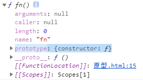

[toc]

# 面向对象

## 单例模式

- 单例模式：
	- 例如：let obj={}
	- 单例：单独的实例
	- 实例：描述一个具体的事物
	- 构造函数：抽象一个类的封装过程

        
- 高级单例模式：
	- 让当前实例功能更加强大
	- 隐藏/暴露细节信息
	- 解决命名冲突问题
	- 例如：
```
let obj=(function(){
		    function sun(){}
		     return{}
		 })()
```

#### 解决命名冲突的方式：
1. 封闭空间（把变量或函数放到函数中） 

```
let a=10
(function(){
   let a=12
})()    
```
        
2. 命名空间

```
//let a=10;
obj1.a=10
//let a=12; 
obj2.a=12
```

## 工厂模式

- 为了`批量`生产实例
- 

## 面向对象

- JS是一个基于面向对象思想构建的编程语言

- 面向对象是一种对现实世界理解和抽象的方法，是计算机编程技术发展到一定阶段后的产物。

- 通过对象来编程，扩展性更强，能够做到高内聚、低耦合。

- 面向对象：
    将具有相同特征/特性的代码，抽离出来归为一类，然后把描述这个类的细节特性(属性、方法)挂在这个类的原型下的一种编程方式。
*** 换了一种写法去写代码 **

- 抽象：抽出像的部分(把相同代码抽离)

- 类：class，某一个类型
- 实例：某一类型中具体的一个个体


## new

> 函数一元运算符，专门运算函数；使用new会执行函数，不加()也会执行。
> 使用new之后，this变成了实例，实例就是一个对象。
> 使用new之后，函数返回值为实例对象，不是undifined。
> 如果return后边有基本类型的值，返回结果还是实例；如果是引用类型的值，返回结果为return后的引用类型

- 创建对象方法：{} ; new Object ; new 函数

```
function fn() {
    console.log(this);
}
//fn() // 函数的this为window
new fn // 函数的this为fn{}(实例)

function fa() {
    //return 3         
    //return [3]         
    return function a() { }
}
console.log(fa());//3//[3]//function a(){}
console.log(new fa);//{}//[3]//function a(){}
```

## 原型

- 原型：构造函数上的属性prototype(是个对象)
> - JS中所有的类(class)都是函数模拟出来的；
> - 当声明一个函数的时候，这个函数自带一些属性或方法，其中有一个属性叫`prototype`，他的`值为对象`，这个prototype就叫原型；函数身上才有原型
>  `函数原型下的属性或方法只给他的实例化对象使用`

 -  

- 原型链：实例身上的属性`__proto__`
	- `__proto__` 实例化对象下都有,这个属性全等于实例的构造函数原型

	- 


- 实例有原型链->函数有原型->原型又是一个对象，对象它就是实例->实例又有原型链->找到构造函数的原型，Object.prototype._ _ proto _ _ = null  
- (顺杆爬，顺藤摸瓜策略)

- 实例下属性->实例原型链->构造函数原型(对象)->构造函数原型(对象)原型链->构造函数的原型->Object.prototype.__proto__ = null

```
 let kitty = new Cat('kitty');
 Object.prototype.skill = 8;
 console.log(kitty.skill);
/*   
 kitty.skill -> kitty.__proto__ -> Cat.prototype -> Cat.prototype = { __proto__:构造函数的原型 } -> Object.prototype  
*/ 
```

