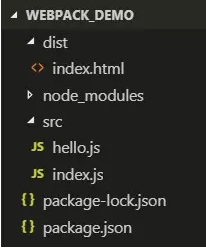
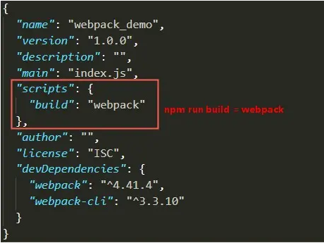
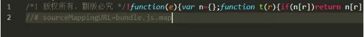
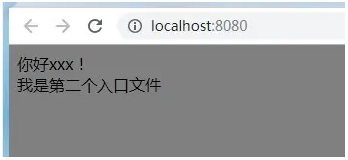

[toc]

## webpack

### 什么是webpack

> webpack是一个打包工具，他的宗旨是一切静态资源皆可打包。
> 为什么要webpack？webpack是现代前端技术的基石，常规的开发方式，比如jquery,html,css静态网页开发已经落后了。现在是MVVM的时代，数据驱动界面。webpack它做的事情是，分析你的项目结构，找到JavaScript模块以及其它的一些浏览器不能直接运行的拓展语言（Scss，TypeScript等），并将其打包为合适的格式以供浏览器使用。

### webpack核心概念

1. Entry（入口）：指示 webpack 应该使用哪个模块，来作为构建其内部依赖图的开始。进入入口起点后，webpack 会找出有哪些模块和库是入口起点（直接和间接）依赖的。

2. Output（出口）：告诉 webpack 在哪里输出它所创建的结果文件，以及如何命名这些文件，默认值为./dist。

3. Loader（模块转换器）：将所有类型的文件转换为 webpack 能够处理的有效模块，然后你就可以利用 webpack 的打包能力，对它们进行处理。

4. Plugins（插件）：在 Webpack 构建流程中的特定时机注入扩展逻辑来改变构建结果或做你想要的事情。

5. Module(模块)：开发者将程序分解成离散功能块，并称之为模块，在webpack里一个模块对应着一个文件，webpack会从配置的 Entry 开始递归找出所有依赖的模块。

6. 服务器配置(dev-server)

### webpack安装使用

1. 新建一个空文件夹用于创建项目， 如下我在D盘创建了一个名为webpack_demo的文件夹，使用终端进入文件夹， 使用 npm init 命令初始化一个package.json文件
	- 输入这个命令后，终端会问你一系列诸如项目名称，项目描述，作者等信息，不过如果你不打算发布这个模块，直接一路回车就好。（也可以使用npm init -y这个命令来一次生成package.json文件，这样终端不会询问你问题）。
  - 使用yarn初始化的命令：yarn init 

2. 安装webpack

```
npm install webpack --global                // 安装全局webpack命令
npm install webpack webpack-cli --save-dev  // 安装本地项目模块 或 yarn add webpack -dev 

// install    可简写为i,
// --global   可简写为-g
// --save     可简写为-S
// --save-dev 可简写为-D
// npm install <-> yarn add
```

3. 新建文件

- 在webpack_demo文件夹下新建两个文件夹，分别为src文件夹和dist文件夹，接着在src文件夹下新增index.js文件和hello.js文件，在dist文件夹下新增index.html文件。此时项目结构如下：


- 在hello.js中导出一个模块

```
// hello.js 
 module.exports = function() {
    let hello = document.createElement('div');
    hello.innerHTML = "hello xxx!";
    return hello;
  };
```

- 在index.js中引入这个hello.js模块

```
// index.js
const hello = require('./hello.js');
document.querySelector("#root").appendChild(hello());
```

- 在index.html下引入打包后的js文件bundle.js

```
<!DOCTYPE html>
<html lang="en">
<head>
    <meta charset="UTF-8">
    <title>Webpack demo</title>
</head>
<body>
    <div id='root'></div>
    <script src="bundle.js"></script>   <!--这是打包之后的js文件，我们暂时命名为bundle.js-->
</body>
</html>
```

4. 进行打包

- 终端输入
- 结果可以看出webpack同时编译了index.js和hello.js，因为index.js文件引入了hello.js模块

```
// webpack全局安装的情况下，output后面的是打包后的文件路径，bundle.js为打包后的js文件名

webpack src/index.js --output dist/bundle.js  

// --output可简写为-o
// 上述命令相当于把src文件夹下的index.js文件打包到dist文件夹下的bundle.js，这样就生成了打包后的文件供index.html引入
```

	

5. 通过配置文件来使用webpack

- 在当前项目的根目录下新建一个配置文件webpack.config.js，我们写下如下简单配置代码，目前只涉及入口配置（相当于我们的index.js，从它开始打包）和出口配置（相当于我们打包生成的bundle.js）。
- 有了这个配置文件，我们只需在终端中运行webpack命令就可进行打包，这条命令会自动引用webpack.config.js文件中的配置选项
```
// webpack.config.js
const path = require('path');
module.exports = {
    entry: path.join(__dirname, "/src/index.js"), // 入口文件
    output: {
        path: path.join( __dirname, "/dist"), // 打包后的文件存放的地方 
        filename: "bundle.js" // 打包后输出文件的文件名
    }
}

// path.join的功能是拼接路径片段
// __dirname是node.js中的一个全局变量，它指向当前执行脚本所在的目录，即D:\webpack_demo
```

6. package.json文件中自定义脚本命令

- Node项目一般都有一个package.json文件，该文件用于描述当前项目，其中有一个scripts属性，该属性可以自定义脚本命令，例如我们运行的打包命令，那么可以在scripts里添加自定义脚本，之后就可以使用npm run build来运行该脚本命令

	

- 我们可以在这里添加每次都需要执行的命令，配置了scripts后， npm run key值相当于在终端运行了value值

### 构建本地服务

1. webpack-dev-server配置本地服务器

	- Webpack提供了一个可选的本地开发服务器，这个本地服务器基于node.js构建，它是一个单独的组件，在webpack中进行配置之前需要单独安装它作为项目依赖：
```
npm install webpack-dev-server -D
```
2. devServer配置项

	- contentBase：该配置项指定了服务器资源的根目录，如果不配置contentBase的话，那么contentBase默认是当前执行的目录,一般是项目的根目录
	- port：指定了开启服务器的端口号，默认为8080
	- host：配置 DevServer的服务器监听地址，默认为 127.0.0.1
	- headers：该配置项可以在HTTP响应中注入一些HTTP响应头。例如：
```
headers: {
      'X-foo': '112233'
    }
```
- historyApiFallback：该配置项属性是用来应对返回404页面时定向跳转到特定页面的。一般是应用在单页应用，比如在访问路由时候，访问不到该路由的时候，通过该配置项，设置属性值为true的时候，会自动跳转到 index.html下。当然我们也可以手动通过 正则来匹配路由
```
  // 跳到index.html页面 
    historyApiFallback: true

    // 使用正则来匹配路由
    historyApiFallback: {
      rewrites: [
        { from: /^\/user/, to: '/user.html' },
        { from: /^\/home/, to: '/home.html' }
      ]
    }
```

- hot：该配置项是指模块替换换功能，DevServer 默认行为是在发现源代码被更新后通过自动刷新整个页面来做到实时预览的，但是开启模块热替换功能后，它是通过在不刷新整个页面的情况下通过使用新模块替换旧模块来做到实时预览的。
- proxy : 有时候我们使用webpack在本地启动服务器的时候，由于我们使用的访问的域名是 http://localhost:8081 这样的，但是我们服务端的接口是其他的，可以通过该配置来解决跨域的问题
- inline：设置为true，当源文件改变时会自动刷新页面
- open：该属性用于DevServer启动且第一次构建完成时，自动使用我们的系统默认浏览器去打开网页。(相当于webpack-dev-server --open 的--open)
- compress：配置是否启用 gzip 压缩，boolean 类型，默认为 false
- overlay：该属性是用来在编译出错的时候，在浏览器页面上显示错误。该属性值默认为false，需要的话，设置该参数为true
```
// 假设服务端接口域名为：http://news.baidu.com
proxy: {
  '/api': {
    target: 'http://news.baidu.com', // 目标接口的域名
    // secure: true,  // https 的时候 使用该参数
    changeOrigin: true,  // 是否跨域
    pathRewrite: {
      '^/api' : ''  // 重写路径
    }
  }
}
```

3. 添加配置项到webpack.config.js

```
// webpack.config.js
const path = require('path');
module.exports = {
  entry: path.join(__dirname, "/src/index.js"), // 入口文件
  output: {
    path: path.join(__dirname, "/dist"), // 打包后的文件存放的地方 
    filename: "bundle.js" // 打包后输出文件的文件名
  },
  devServer: {
    contentBase: path.join(__dirname, "dist"),
    hot: true,
    port: '8080',
    inline: true,
    open: true,
    overlay: true,
    proxy: {
      '/api': {
        target: '', 
        changeOrigin: true,  
        pathRewrite: {
          '^/api': ''  
        }
      }
    }
  }
}
```

4. 在package.json文件中添加启动命令

- 我们用dev来启动本地服务器， webpack-dev-server就是启动服务器的命令，- -opn是用于启动完服务器后自动打开浏览器，这时候我们自定义命令方式的便捷性就体现出来了，可以多个命令集成在一起运行，即我们定义了一个dev命令名称就可以同时运行了webpack-dev-server和- -opn两个命令
- 这样我们就可以在http://localhost:8088/中查看页面 (退出服务器，可使用ctrl+c后，再按y确认即可退出服务器运行)
```
 "scripts": {
    "build": "webpack", //webpack -w 可以在每次更改之后自动输出文件
    "dev": "webpack-dev-server --open"
  },
```

#####  Source Maps调试配置

- 经过打包后的文件，你是不容易找到出错的地方的，Source Map就是用来解决这个问题的。通过如下配置，我们会在打包时生成对应于打包文件的.map文件，使得编译后的代码可读性更高，更易于调试。

```
// webpack.config.js
const path = require('path');
module.exports = {
  entry: path.join(__dirname, "/src/index.js"), // 入口文件
  output: {
    path: path.join(__dirname, "/dist"), // 打包后的文件存放的地方 
    filename: "bundle.js" // 打包后输出文件的文件名
  },
  devServer: {
    contentBase: path.join(__dirname, "dist"),
    hot: true,
    port: '8080',
    inline: true,
    open: true,
    overlay: true,
  },
  devtool: 'source-map' // 会生成对于调试的完整的.map文件，但同时也会减慢打包速度
}
```

- 配置好后，我们再次运行npm run build进行打包，这时我们会发现在dist文件夹中多出了一个bundle.js.map。如果我们的代码有bug，在浏览器的调试工具中会提示错误出现的位置，这就是devtool：'source-map' 配置项的作用。

### Loaders

> loaders是webpack最强大的功能之一，通过不同的loader，webpack有能力调用外部的脚本或工具，实现对不同格式的文件的处理，例如把scss转为css，将ES66、ES7等语法转化为当前浏览器能识别的语法，将JSX转化为js等多项功能。Loaders需要单独安装并且需要在webpack.comfig.js中的modules配置项下进行配置，Loaders的配置包括以下几方面：

- test：一个用以匹配loaders所处理文件的拓展名的正则表达式（必须）
- loader：loader的名称（必须）
- include/exclude： 手动添加必须处理的文件（文件夹）或屏蔽不需要处理的文件（文件夹）（可选）
- options： 为loaders提供额外的设置选项（可选）

#####  配置css-loader

- 如果我们要加载一个css文件，需要安装style-loader和css-loader
	- npm install style-loader css-loader -D

```
// webpack.config.js
const path = require('path');
module.exports = {
  entry: path.join(__dirname, "/src/index.js"), // 入口文件
  output: {
    path: path.join(__dirname, "/dist"), // 打包后的文件存放的地方 
    filename: "bundle.js" // 打包后输出文件的文件名
  },
  devServer: {
    contentBase: path.join(__dirname, "dist"),
    hot: true,
    port: '8080',
    inline: true,
    open: true,
    overlay: true,
  },
  devtool: 'source-map', // 会生成对于调试的完整的.map文件，但同时也会减慢打包速度
  module: {
    rules: [
      {
        test: /\.css$/,   // 正则匹配以.css结尾的文件
        use: ['style-loader', 'css-loader']  // 需要用的loader，一定是这个顺序，因为调用loader是从右往左编译的
      }
    ]
  }
}
```

- 我们在src文件夹下新建index.css文件，设置body的样式，在src文件夹下的index.js引入它，运行npm run dev启动服务器，会发现页面背景颜色变成了灰色

```
// index.js
import './index.css' // 导入css

const hello = require('./hello.js');
document.querySelector("#root").appendChild(hello());
```

#####  配置sass(可选)

- npm install sass-loader node-sass -D // 因为sass-loader依赖于node-sass，所以还要安装node-sass

```
module: {
    rules: [
      {
        test: /\.css$/,   // 正则匹配以.css结尾的文件
        use: ['style-loader', 'css-loader']  // 需要用的loader，一定是这个顺序，因为调用loader是从右往左编译的
      },
      {
        test: /\.(scss|sass)$/,   // 正则匹配以.scss和.sass结尾的文件
        use: ['style-loader', 'css-loader', 'sass-loader']  // 需要用的loader，一定是这个顺序，因为调用loader是从右往左编译的
      }
    ]
  }
```

### Plugins（插件）

> 插件（Plugins）是用来拓展Webpack功能的，它们会在整个构建过程中生效，执行相关的任务。Loaders和Plugins常常被弄混，但是他们其实是完全不同的东西，可以这么来说，loaders是在打包构建过程中用来处理源文件的（JSX，Scss，Less..），一次处理一个，插件并不直接操作单个文件，它直接对整个构建过程其作用。

1. 使用插件

- 如需使用某个插件，需要通过npm进行安装，然后在webpack.config.js配置文件的plugins配置项中添加该插件的实例，下面我们先来使用一个简单的版权声明插件。

```
// webpack.config.js
const path = require('path');
const webpack = require('webpack');  // 这个插件不需要安装，是基于webpack的，需要引入webpack模块
module.exports = {
  entry: path.join(__dirname, "/src/index.js"), // 入口文件
  output: {
    path: path.join(__dirname, "/dist"), // 打包后的文件存放的地方 
    filename: "bundle.js" // 打包后输出文件的文件名
  },
  devServer: {
    contentBase: path.join(__dirname, "dist"),
    hot: true,
    port: '8080',
    inline: true,
    open: true,
    overlay: true,
  },
  devtool: 'source-map', // 会生成对于调试的完整的.map文件，但同时也会减慢打包速度
  module: {
    rules: [
      {
        test: /\.css$/,   // 正则匹配以.css结尾的文件
        use: ['style-loader', 'css-loader']  // 需要用的loader，一定是这个顺序，因为调用loader是从右往左编译的
      },
      {
        test: /\.(scss|sass)$/,   // 正则匹配以.scss和.sass结尾的文件
        use: ['style-loader', 'css-loader', 'sass-loader']  // 需要用的loader，一定是这个顺序，因为调用loader是从右往左编译的
      }
    ]
  },
  plugins: [
    new webpack.BannerPlugin('版权所有，翻版必究')  // new一个插件的实例 
  ]
}
```

- 运行npm run build 打包后，我们查看dist下面的handle.js文件显示如下：



#####  自动生成html文件（HtmlWebpackPlugin）

- 到目前为止我们都是使用一开始建好的index.html文件，而且也是手动引入bundle.js，要是以后我们引入不止一个js文件，而且更改js文件名的话，也得手动更改index.html中的js文件名，所以能不能自动生成index.html且自动引用打包后的js呢？HtmlWebpackPlugin插件就是用来解决这个问题的
- 我们对项目结构进行一些更改：
		- 把整个dist文件夹删除
		- 在src文件夹下新建一个index.html(名称自定义)文件模板（当然这个是可选的，因为就算不设置模板，HtmlWebpackPlugin插件也会生成默认html文件，这里我们设置模块会让我们的开发更加灵活），如下：

```
<!-- index.html -->
<!DOCTYPE html>
<html lang="en">
  <head>
    <meta charset="utf-8">
    <title></title>
  </head>
  <body>
    <div id='root'>
    </div>
  </body>
</html>
```

- 安装HtmlWebpackPlugin插件: npm install html-webpack-plugin -D
-  引入HtmlWebpackPlugin插件，并配置了引用了我们设置的模板，如下：

```
const HtmlWebpackPlugin = require('html-webpack-plugin'); // 引入HtmlWebpackPlugin插件

//插件配置
  plugins: [
    new webpack.BannerPlugin('版权所有，翻版必究'),  // new一个插件的实例 
    new HtmlWebpackPlugin({
      template: path.join(__dirname, "/src/index.html")// new一个这个插件的实例，并传入相关的参数
    })
  ]
```

- 运行npm run build进行打包，dist文件夹自动生成，包含index.html、bundle.js、bundle.js.map三个文件

- 为什么会自动生成dist文件夹呢？因为我们在output出口配置项中定义了出口文件所在的位置为dist文件夹，且出口文件名为bundle.js，所以HtmlWebpackPlugin会自动帮你在 dist/index.html 中引用名为bundle.js文件，如果你在webpack.config.js文件中更改了出口文件名，dist/index.html 中也会自动更改该文件名，这样以后修改起来是不是方便多了？

##### 清理dist文件夹（CleanWebpackPlugin）

- webpack会生成文件，然后将这些文件放置在dist文件夹中，但是webpack无法追踪到哪些文件是实际在项目中用到的。通常，在每次构建前清理dist文件夹，是比较推荐的做法，因此只会生成用到的文件，这时候就用到CleanWebpackPlugin插件了。
- 每运行一次npm run build，webpack会先将dist文件夹删除，然后再生产新的dist文件夹。
- 安装插件：npm install clean-webpack-plugin -D

```
const CleanWebpackPlugin = require('clean-webpack-plugin'); // 引入CleanWebpackPlugin插件

//插件配置
plugins: [
    new webpack.BannerPlugin('版权所有，翻版必究'),  // new一个插件的实例 
    new HtmlWebpackPlugin({
      template: path.join(__dirname, "/src/index.html")// new一个这个插件的实例，并传入相关的参数
    }),
    new CleanWebpackPlugin(['dist']),  // 所要清理的文件夹名称
  ]
```

##### 热更新（HotModuleReplacementPlugin）

- 可以在我们修改代码后自动刷新预览效果。

设置方法(两种设置其一即可)：

- devServer配置项中添加 hot：true 参数。
- 因为HotModuleReplacementPlugin是webpack模块自带的，所以引入webpack后，在plugins配置项中直接使用即可

```
	new webpack.HotModuleReplacementPlugin() // 热更新插件 
```

### 项目优化及拓展

#####  代码分离

- 我们的webpack.config.js配置文件，其实也没配置多少东西就这么多了，要是以后增加了更多配置，岂不是看得眼花缭乱，所以最好的方法就是把它拆分，方便管理：
- 1、 我们在根目录下新建三个文件，分别为webpack.common.js、webpack.dev.js、webpack.prod.js分别代表公共配置文件、开发环境配置文件、生产环境（指项目上线时的环境）配置文件。
- 2、安装一个合并模块插件：npm install webpack-merge -D
- 3、将webpack.config.js的代码拆分到上述新建的三个文件中，然后把将webpack.config.js文件删除，具体如下：

```
// webpack.common.js
const path = require('path');
const webpack = require('webpack');  // 这个插件不需要安装，是基于webpack的，需要引入webpack模块
const HtmlWebpackPlugin = require('html-webpack-plugin'); // 引入HtmlWebpackPlugin插件
module.exports = {
  entry: path.join(__dirname, "/src/index.js"), // 入口文件
  output: {
    path: path.join(__dirname, "/dist"), // 打包后的文件存放的地方 
    filename: "bundle.js" // 打包后输出文件的文件名
  },
  module: {
    rules: [
      {
        test: /\.css$/,   // 正则匹配以.css结尾的文件
        use: ['style-loader', 'css-loader']  // 需要用的loader，一定是这个顺序，因为调用loader是从右往左编译的
      },
      {
        test: /\.(scss|sass)$/,   // 正则匹配以.scss和.sass结尾的文件
        use: ['style-loader', 'css-loader', 'sass-loader']  // 需要用的loader，一定是这个顺序，因为调用loader是从右往左编译的
      }
    ]
  },
  plugins: [
    new webpack.BannerPlugin('版权所有，翻版必究'),  // new一个插件的实例 
    new HtmlWebpackPlugin({
      template: path.join(__dirname, "/src/index.html")// new一个这个插件的实例，并传入相关的参数
    }),
    new webpack.HotModuleReplacementPlugin() // 热更新插件 
  ]
}
```

```
// webpack.dev.js
const path = require('path');
const merge = require('webpack-merge');  // 引入webpack-merge功能模块
const common = require('./webpack.common.js'); // 引入webpack.common.js

module.exports = merge(common, {   // 将webpack.common.js合并到当前文件
    devServer: {
        contentBase: path.join(__dirname, "dist"),
        hot: true,
        port: '8080',
        inline: true,
        open: true,
        overlay: true,
    },
})
```

```
// webpack.prod.js
const merge = require('webpack-merge');
const common = require('./webpack.common.js');
const { CleanWebpackPlugin } = require('clean-webpack-plugin'); // 引入CleanWebpackPlugin插件

module.exports = merge(common, { // 将webpack.common.js合并到当前文件
    devtool: 'source-map',  // 会生成对于调试的完整的.map文件，但同时也会减慢打包速度
    plugins: [
        new CleanWebpackPlugin(),  
    ]
})
```

- 4、设置package.json的scripts命令

```
 "scripts": {
    "build": "webpack --config webpack.prod.js",
    "dev": "webpack-dev-server --open --config webpack.dev.js"
  },
```

> 我们把build命令改为了webpack --config webpack.prod.js，意思是把打包配置指向webpack.prod.js配置文件，而之前我们只需要使用一个webpack 命令为什么就可以运行了？因为webpack 命令是默认指向webpack.config.js这个文件名称了，现在我们把文件名称改了，所以就需要自定义指向新的文件，dev命令中的指令也同理。然后我们运行npm run build 和npm run dev，效果应该和我们分离代码前是一样的。

##### 多入口 多出口

- 在webpack.common.js中的entery入口有三种写法，分别为字符串、数组和对象，平时我们用得比较多的是对象，所以我们把它改为对象的写法，首先我们在src文件夹下新建index2.js文件，名称任意。因为有多个入口，所以肯定得多个出口来进行一一对应了，所以entry和output配置如下：

```
  entry: {
        index: path.join(__dirname, "/src/index.js"),
        index2: path.join(__dirname, "/src/index2.js")
    },
    output: {
        path: path.join(__dirname, "/dist"), // 打包后的文件存放的地方 
        filename: "[name].js" // 打包后输出文件的文件名(name自动为入口的key值)
    },
```

```
// index2.js
function page2() {
    let element = document.createElement('div');
    element.innerHTML = '我是第二个入口文件';
    return element;
}

document.getElementById('root').appendChild(page2());
```

- 然后我们运行npm run build打包后发现dist文件夹下会多出index2.js文件，同时index.html也会自动将index2.js引入，然后我们运行npm run dev显示如下：



##### 3.分离css

- 旧版：npm install extract-text-webpack-plugin@next -D  // 加上@next是为了安装最新的，否则会出错
- 新版：mini-css-extract-plugin 

```
// webpack.common.js
//引入
const miniCssPlugin=require('mini-css-extract-plugin');//css分离

//配置
module: {
        rules: [
            {
                test: /\.css$/,   // 正则匹配以.css结尾的文件
                use: ExtractTextPlugin.extract({  // 这里我们需要调用分离插件内的extract方法
                    fallback: 'style-loader',  // 相当于回滚，经css-loader处理过的css最终再经过style-loader处理
                    use: ['css-loader']
                })
            },
    plugins: [
        new webpack.BannerPlugin('版权所有，翻版必究'),  // new一个插件的实例 
        new HtmlWebpackPlugin({
            template: path.join(__dirname, "/src/index.html")// new一个这个插件的实例，并传入相关的参数
        }),
        new webpack.HotModuleReplacementPlugin(), // 热更新插件
        new ExtractTextPlugin('css/index.css') // 将css分离到/dist文件夹下的css文件夹中的index.css 
    ]

```

##### 消除冗余的css

- 优化重复代码：npm install purifycss-webpack purify-css glob -D

```
// webpack.prod.js
const path = require('path');
const merge = require('webpack-merge');
const common = require('./webpack.common.js');
const { CleanWebpackPlugin } = require('clean-webpack-plugin'); // 引入CleanWebpackPlugin插件
const PurifyCssWebpack = require('purifycss-webpack'); // 引入PurifyCssWebpack插件
const glob = require('glob');  // 引入glob模块,用于扫描全部html文件中所引用的css

module.exports = merge(common, { // 将webpack.common.js合并到当前文件
    devtool: 'source-map',  // 会生成对于调试的完整的.map文件，但同时也会减慢打包速度
    plugins: [
        new CleanWebpackPlugin(),
        new PurifyCssWebpack({
            paths: glob.sync(path.join(__dirname, 'src/*.html')) // 同步扫描所有html文件中所引用的css
        })
    ]
})
```

##### 处理图片

- npm install url-loader file-loader -D 
- 虽然我们只需使用url-loader，但url-loader是依赖于file-loader的，所以也要安装
- 然后在webpack.common.js中配置url-loader

```
 {
  test: /\.(png|jpg|svg|gif)$/,  // 正则匹配图片格式名
       use: [
           { loader: 'url-loader'  // 使用url-loader }
       ]
   }
```

- 我们把index.css的背景改为图片，页面就会显示出来
```
/* index.css */
body {
    background: url('./images/bg.jpg') no-repeat;
    background-size: 200px 250px;
    color: #fff;
}
```

- 我们会发现背景图片变成了base64，因为webpack会自动优化图片，减少发送请求
- 如果我想把它变成路径 可以把webpack.common.js的loader配置更改一下，增加options选项：

```
module: {
    rules: [
      {
        test: /\.css$/,   // 正则匹配以.css结尾的文件
        use: ExtractTextPlugin.extract({  // 这里我们需要调用分离插件内的extract方法
          fallback: 'style-loader',  // 相当于回滚，经css-loader处理过的css最终再经过style-loader处理
          use: ['css-loader'],
          publicPath: '../'  // 给背景图片设置一个公共路径
        })
      },
      {
        test: /\.(scss|sass)$/,   // 正则匹配以.scss和.sass结尾的文件
        use: ['style-loader', 'css-loader', 'sass-loader'],  // 需要用的loader，一定是这个顺序，因为调用loader是从右往左编译的
      },
      {
        test: /\.(png|jpg|svg|gif)$/,  // 正则匹配图片格式名
        use: [
          {
            loader: 'url-loader',  // 使用url-loader
            options: {
              limit: 1000,  // 限制只有小于1kb的图片才转为base64，例子图片为1.47kb,所以不会被转化
              outputPath: 'images',  // 设置打包后图片存放的文件夹名称
            },
          }
        ]
      },
    ]
  },
```

##### 6.压缩代码

> 在webpack4.x版本中当你打包时会自动把js压缩了，而且npm run dev运行服务器时，当你修改代码时，热更新很慢，这是因为你修改后webpack又自动为你打包，这就导致了在开发环境中效率很慢，所以我们需要把开发环境和生产环境区分开来，这时就体现出我们代码分离的便捷性了，webpack.dev.js代表开发环境的配置，webpack.prod.js代表生产环境的配置，这时我们只要在package.json文件中配置对应环境的命令即可：

```
 "scripts": {
    "build": "webpack --config webpack.prod.js --mode production",
    "dev": "webpack-dev-server --open --config webpack.dev.js --mode development"
  },
```

- --mode production表示打包时是生产环境，会自己将js进行压缩，而--mode development表示当前是开发环境，不需要进行压缩。这同时也解决了之前一直遗留的警告问题


> 另外
```
// 引入
const OptimizeCSSAssetsPlugin = require('optimize-css-assets-webpack-plugin');//css压缩
const TerserPlugin = require('terser-webpack-plugin');//js压缩

// 压缩配置
optimization: {
        minimizer: [
            // new UglifyJsPlugin({
            //     cache: true,//缓冲
            //     parallel: true, //并发打包,一次打包多个
            //     sourceMap:true,//源码调试
            // }),

            new TerserPlugin({
                cache: true,
                parallel: true,
                sourceMap: true, // Must be set to true if using source-maps in production
                terserOptions: {
                  // https://github.com/webpack-contrib/terser-webpack-plugin#terseroptions
                }
              }),
            new OptimizeCSSAssetsPlugin({})
        ]
    }
```

```
// 压缩配置
plugins:[
        new HtmlWebpackPlugin({
            template:'./index.html',
            filename:'index.html',
            title:'哈哈',
            minify:{
                removeComments: true,//去除html中的注释
                collapseWhitespace: true,// 删除空白符与换行符
                collapseBooleanAttributes: true,////是否简写boolean格式的属性如：disabled="disabled" 简写为disabled  默认false
                removeAttributeQuotes: true,////是否移除属性的引号 默认false
            }
        }),
        new miniCssPlugin({
            filename:'./css/[name].css'
        }),
        // new UglifyJsPlugin(),
        // new OptimizeCSSAssetsPlugin({})
    ],
```