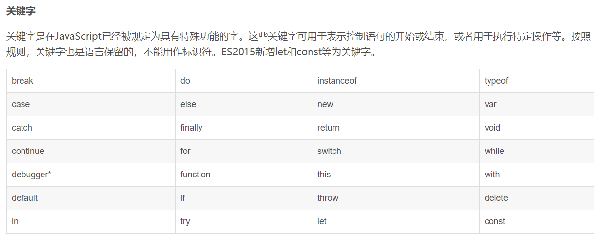
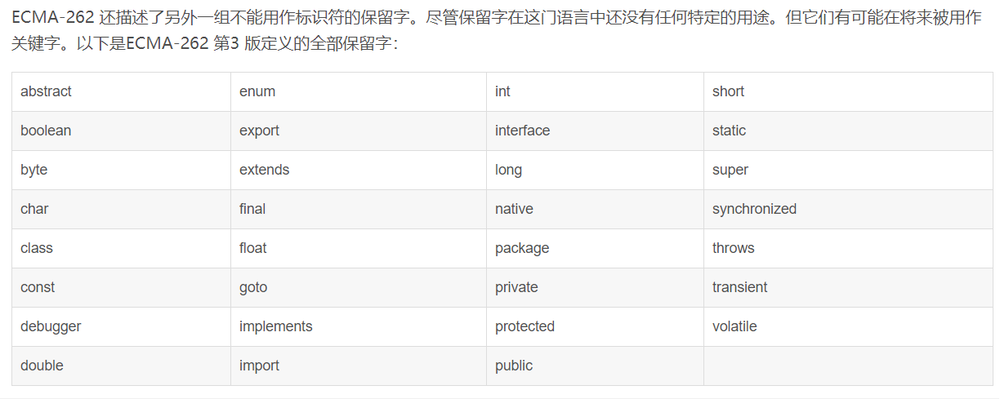
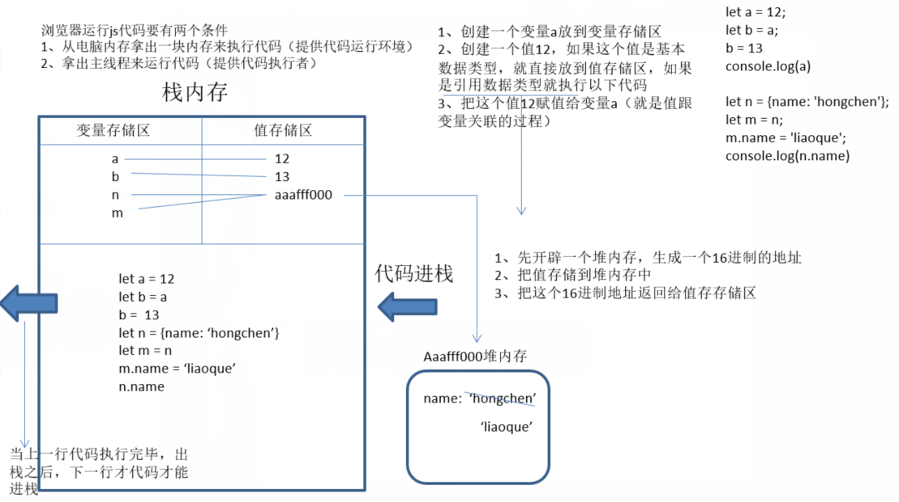

[toc]


## JavaScript组成命名数据类型

> JS作为客户端的一种语言，不仅要操作dom对象，还要操作浏览器一些功能。

### 组成（核心知识）

- ECMAScript3/5（老版本）；ES6/7（新版本）
	- 基本语法标准
	- 这是js的语法规范，规定了js的语法、变量、操作语句。
- DOM（document object model）：文档对象模型，提供一些js的属性和方法来操作页面中的DOM元素。
- BOM（borwser object model）：浏览器对象模型，提供一些js的属性和方法来操作浏览器。

### 引入方式

1. 行内式：通过向 html 元素行内添加一些 js 代码。
2. 内嵌式：在 html 文档中写一个 script 标签，把 js 写在 script 标签内。写在body结束标签上方
3. 外链式：在 html 文档中写一个 script 标签，并且设置 src 属性，src 的属性值引用一个 js 文件资源，而 js 代码写在 js 文件中
	- 使用外链式引入 js 文件时，script 标签里面不能再写 js 代码了，即使写了也不会执行。

> 无论是内嵌式还是外链式，都建议把 script 标签写在 body 结束标签的前面

### 变量

> 可变的量、数据，把数据存储到一个自定义的名字中（用let或var声明），达到复用的目的

### 常量

> 不可变的量、数据，把数据存储到一个自定义的名字中（用const声明），达到复用的目的

- let 创建变量（不能重复创建相同变量，可给相同变量重新赋值；ES6）
```
let a = 12;
    a = 66;
```
- var 创建变量（能重复创建相同变量）
```
var b = 22;
var b = 32;
```
- function 创建函数变量
```
function fb(){}
```
- const 创建常量（不允许修改，ES6）
```
const c = 33;
```
- class 创建类
```
class d {}
```
- import 导入
```
 import e from 'js/e.js'
// 导入  e  从   文件路径，即把路径文件给e；
```
- Symbol 创建唯一值（几乎不用）
```
// 下边f不等于g
let f = Symbol(50);
let g = Symbol(50);
```

### 变量命名规范

- 严格区分大小写。
- 由数字、字母、下划线、$组成，但不能以数字开头。
- 不能以保留字或者关键字作为变量名。
- 变量名遵循驼峰命名法（利于阅读）。
```
<script>
	let _h = 33; //下划线开头代表公共变量
	let $i = ''; //$开头代表在JQ中获取什么
  // add/delete/num/info/select/get/set/update
  // 增加/删减/数字/信息/选择/获取/设置/更新
</script>
```





### 数据类型

#### 数据类型分类

##### 基本数据类型(储存在栈(stack))

- 有效数字/NaN ：number数字
- '12'（单引号，双引号） ：string字符串（``ES6模板字符串）
- true/false ：boolean布尔
- null ：空指针对象 
- underfined ：未定义
- Symbol ：唯一
- 
##### 引用数据类型(储存在堆(heap))

- 对象类型 object
	- {name: 'xxx', age: 20} 普通对象（大括号内N个键值对组成，键值对由 “名称：值” 组成，键值对之间用“，”分隔）
	- [1,'2','a'] 数组
	- Math 数学对象（数学公式）
	- /^$/ 正则
	- Date 
- 函数类型 function

> 区别：赋值时，基本数据类型是按值操作（克隆一份数据赋值给某个变量）；引用数据类型是按址操作（地址），两个变量的地址可以指向同一个堆内存。

#### 数字(number)

- 包括NaN和有效数字【`NaN`(not a number) 属于数字类型，但不是数字。它与任何值都不相等，包括自己。】

##### 把值转换成数字（Number(val)）

- 把字符串转换为数字
	- 只要字符串中出现非有效数字，结果就是NaN（第一位小数点不算）
    - `空字符串转数字是0`
-  把布尔转换为数字
    - Number(true)=> 1
    - Number(false)=> 0
- 把null和undefined转换为数字
    - Number(null) => 0
    - Number(undefined) => NaN
- 把普通或数组对象转数字
    - 普通对象转数字，先把对象转字符串，然后在转数字
	    - 普通对象转字符串结果都是[object Object]
		({name:'xxx'}).toString() => [object Object]
		({}).toString() => [object Object]
    - 数组转数字，先把数组转字符串，然后在转数字(其中空数组转字符串为 ''(空串))
	    - 数组转字符串就是去掉[],然后里边内容加上字符串
		[12,23].toString() => '12,23'
		[].toString() => ''(空串)
-  isNaN
	-	 isNaN 他会检测数据类型值是否为非有效数字，如果是非有效数字就是true，反之就是false（有效数字就是false，不是有效数字就是true）
  - 在使用isNaN的时候，如果发现检测的值的数据类型不是number类型的，要把它先转换为数字，在判断

```
<script>
  // number ：0、1、-1、1.5、 
       //  NaN(not a number) 属于数字类型，但不是数字
    // 把其他值转化成number：Number()
       // 把字符串转化number
       // 规律：只要字符串中出现非有效数字，结果就是NaN（第一位小数点不算）
       //空字符串转数字是0
         console.log(Number('1'))// 1
         console.log(Number('1a'))// NaN
         console.log(Number('1.1px'))// NaN
         console.log(Number('1.1'))// 1.1
         console.log(Number('1.1.1'))// NaN
         console.log(Number(''))// 0
       // 把布尔值转化成number
         console.log(Number(true))// 1
         console.log(Number(false))// 0
       // null与undefined转数字
         console.log(Number(null))// 0
         console.log(Number(undefined))// NaN
       // NaN转数字
         console.log(Number(NaN))//NaN
       // 引用数据类型转数字
       // 普通对象、数组转数字，先把对象、数组转成字符串，再转成数字
       // 普通对象转数字          
         console.log(Number({name:'xxx'}))// NaN
       // 普通对象转字符串结果都是'[object Object]'
         console.log(({name:'xxx'}).toString());// '[object Object]'
         console.log(Number({}))//NaN
       // 数组转数字
         console.log(Number([12,23]))//NaN
       // 数组转字符串就是去掉[],然后里边内容加上字符串
         console.log(([12,23]).toString())//12,23
       //空字符串转数字是0
         console.log(Number([])) // 0
       // 空数组转字符串是''(空串)
         console.log([].toString()) // '' (空串)
    // isNaN 他会检测数据类型是否是非有效数字，如果是非有效数字就是true，反之false。
         console.log(isNaN('a'))//true
         console.log(isNaN(1.1))//false
         console.log(isNaN(NaN))//true
    // 检测数据类型时如果发现不是number类型，要把它先转换成数字在判断。    
         console.log(isNaN([12,23]))//true
</script>
```

##### 转数字之parseInt()与parseFloat()

- parseInt

> 从左往右依次查找，一旦遇到非有效数字，立即停止，把数字返回。
> 如果把数组转数字，就看数组第一项，把第一项从左往右依次查找，一旦遇到非有效数字，立即停止，把数字返回。
> parseInt('值',进制数)，输出十进制数，如parentInt('110',2)->6；二进制110转十进制为6

- parseFloat

> parseFloat 可以识别一位小数点
```
 parseInt(3.4) // 3
 parseInt('3.4') // 3
 parseInt('3px') // 3
 //只要不是有效数字，就是NaN
 parseInt(NaN) // NaN
 parseInt('N3') // NaN
 parseInt(true) // NaN
 parseInt({name:123}) // NaN
 //数组较特殊
 parseInt([1,2]) // 1
 parseInt([11.2]) // 11
 parseInt(['d',2]) // NaN
 
 parseFloat(['4.23.4',2]) // 4.23
 parseFloat('3.14r') // 3.14
 //其他的同parseInt
```

#### toFixed

- 四舍五入，保留几位有效数字：num.toFixed(位数)

```
let a = 1.293945
console.log(a.toFixed(3));//1.294
```

#### 字符串(string)

> - 用单引号('')、双引号("")、反引号(``) 
>  - 反引号(``) : ES6的模板字符串，字符串中拼接其他内容可以用${} ，把要拼接的内容放到大括号中
>  - 大括号中也可运算。
> - 字符串有length，只可读不可写
> - 把别的数据类型转换为string类型（1. val.toString(); 2. 字符串拼接）

> `页面中所有文本都是字符串`

##### 转字符串（val.toString()）

+ 把对象转字符串 => '[object Object]'
+ 把数组转换为字符串 : 把数组的中括号去掉，然后加上引号
+ 数字、布尔转字符串是直接加引号
+ null和undefined不能直接调用toString方法，他会报错（可以使用字符串拼接）
```
({}).toString() // '[object Object]'
[].toString() // ''
[23,24].toString() // '23,24'
(23).toString() // '23'
true.toString() // 'true'
false.toString() // 'false'

null+''.toString() // 'null'
```

##### 字符串中的方法

- 字符串的方法都不改变原字符串
- 每个字符对应一个索引，从零开始依次增加(类似数组)。
- 不能通过length操作字符串

```
       let str='asdfghjkl'
        console.log(str.length); //9
        console.log(str[0]); //'a'
        console.log(str[str.length-1]); // 'l'
        // 通过length操作字符串不成
        console.log(str.length--);//不能删
        console.log(str[str.length]='q');//不能改
        console.log(str);//'asdfghjkl'
```
###### 获取（charAt()；charCodeAt()）
1. charAt()：通过索引获取指定字符串,参数为索引
2. charCodeAt()：通过索引找到对应字符串的ASCII码（Unicode码），参数为索引
3. String.fromCharCode()：根据ASCII码值转字符串
```
	 let str='asdfghjkl'
        console.log(str.charAt(0)); //a
        console.log(str[0]); //a
        console.log(str.charAt(100)); //''
        console.log(str[100]); //undefined
        console.log(str.charCodeAt(0)); //97
        console.log(str.charCodeAt(2)); //100
        console.log(String.fromCharCode(97)); //'a' （ASCII码对应的字符串）
        console.dir(String);//输出String里边的详细内容
```
###### 截取类（substr(n,m)；substring(n,m)；slice(n,m)）

3. substr(n,m)：从索引n开始，查询m个;
	- 返回查询到的字符串,查询不到就空串
	- 参数为零或不写则一查到底
4. substring(n,m)：从索引n开始，查询到索引m（不包括索引m那项）
	- 若m<n，则从m查询到n
	- 返回查询到的字符串,查询不到就空串
	- 参数为零或不写则一查到底
5. slice(n,m)：从索引n开始，查询到索引m（不包括索引m那项）
	- m<n时返回空串
	- 支持负数，(若为负数，需要加上length);
	- 返回查询到的字符串,查询不到就空串
	- 参数为零或不写则一查到底

```
		let str='asdfghjkl'
         console.log(str.substr(2,3)); //'dfg'
         console.log(str.substr(0)); //'asdfghjkl' (一查到底)
         console.log(str.substr()); //'asdfghjkl' (一查到底)
         console.log(str.substring(3,5)); //'fg'
         console.log(str.substring(5,3)); //'fg'
         console.log(str.substring(0)); //'asdfghjkl' (一查到底)
         console.log(str.substring()); //'asdfghjkl' (一查到底)
         console.log(str.slice(-3,-1)); //'jk'(参数 + length值之后查询，即(6,8))
         console.log(str.slice(5,3)); //''
```

###### 查找类（indexOf(x,y)；lastIndexOf(x,y)；includes()）

6. indexOf('x',y)：检测某个值开始的位置(从前往后查找第一个)
	- 把对应的索引返回（查询不到返回-1）
	- x是要查询的值，y是开始查询的索引。
7. lastIndexOf('x',y)：检测某个值最后出现的位置(从后往前查找第一个)
	- 把对应的索引返回（查询不到返回-1）
	- x是要查询的值，y是开始查询的索引。
8. includes('x')：查询某个值，参数为指定的值，有就是true，没有就false。

```
        let str1='asdfaghajkl'
        console.log(str1.indexOf('d')); //2
        console.log(str1.indexOf('fag')); //3(当成整体查询)
        console.log(str1.indexOf('a',2)); //4
        console.log(str1.lastIndexOf('a')); //7
        console.log(str1.lastIndexOf('a',5)); //4
        console.log(str1.includes('agh')); //true
```

###### 转大小写（toUpperCase()；toLowerCase()）

9. toUpperCase()：小写转大写，返回转换后的字符串
10. toLowerCase()：大写转小写，返回转换后的字符串

```
      let str2='asd123FAG哈喽haJKl'
        console.log(str2.toUpperCase()); //'ASD123FAG哈喽HAJKL'
        console.log(str2.toLowerCase()); //'asd123fag哈喽hajkl'
```

###### 转数组（split()）

11. split()：把字符串以指定分隔符分割出每一项组成数组返回数组。
	- 参数为指定的分隔符，如果没有就整个当做一项转为数组

```
        let str3='asd|123|FAG|哈喽|haJKl'
        console.log(str3.split('|')); // ['asd', '123', 'FAG', '哈喽', 'haJKl']
        console.log(str3.split('')); // ['a', 's', 'd', '|', '1', '2', '3', '|', 'F', 'A', 'G', '|', '哈', '喽', '|', 'h', 'a', 'J', 'K', 'l']
        console.log(str3.split()); // ['asd|123|FAG|哈喽|haJKl']
        // 把分隔符 “|” 改成 “,” 和 “-”。
        console.log(str3.split('|').toString()); //'asd,123,FAG,哈喽,haJKl'
        console.log(str3.split('|').join('-')); //'asd-123-FAG-哈喽-haJKl'
```

###### 替换（replace('x','y')）

12. replace('x','y')：把x替换为y
	- 参数：x：原字符；y：新字符
	- 返回替换后的字符串（替换失败则返回原字符串）
	- 只替换第一个，可写多次则替换多个
	- 可利用正则实现全局替换

```
      let str4='adsfgafgjafe'
        console.log(str4.replace('a','w')); //替换一个 'wdsfgafgjafe'
        console.log(str4.replace('a','w').replace('a','w').replace('s','m')); //再替换一个 'wdmfgwfgjafe'
        console.log(str4.replace(/a/g,'w')); // 用正则，全局替换 'wdsfgwfgjwfe'
        console.log(str4.replace('5','4')); //'adsfgafgjafe' (替换失败，啥也不改)

      let dat='2019-10-23 12:25 '
        console.log(dat.replace('-','年').replace('-','月').replace(' ','日').replace(':','时').replace(' ','分')) ; // 2019年10月23日12时25分
```

#### 布尔(boolean)

> true/false

- Boolean 布尔
- !/!! 取反/取反再取反
- if 条件判断

##### 转布尔（Boolean()）

> 其他数据类型转布尔，有且只有**`null`**、**`undefined`**、**`0`**、**`''`**、**`NaN`**是**false**，其他都是**true**，没有意外。
注：`空串中加空格转换后是true`。
```
    Boolean(null) // false
    Boolean(undefined) // false
    Boolean('') // false
    Boolean('   ') // true
    Boolean(0) // false
    Boolean(NaN) // false
    Boolean(false) // false 
```

##### 转布尔(!和!!)

> !：取反，先把值转换为布尔，再取反。

```
 !''  // true
 !null  // true
 !undefined  //true
```
> !!：先把值把转布尔之后取反再取反，转换值等同Boolean。

```
 !!1 // true
 !!'' // false
 !!NaN // false
```

##### 转布尔(if条件判断)

> 如果括号内判断条件转布尔结果为true，则执行下边代码；如果判断条件转换结果为false，则不执行。

```
// 括号内为判断条件，括号里的值会转布尔，如果括号里布尔值为true就执行大括号里的东西
if('1'){
    console.log('xxx')
}
```

#### null和undefined

> null和undefined代表空

- null：一般我们需要设置变量但开始不知道值，可以先设置值为null，后经过逻辑操作再赋值（不占位）。
- undefined：本就没打算有值。
```
let a = null;
....//一系列逻辑运算。。。再给他赋值
a = 'xxx'
```

##### 出现null的情况

1. 手动赋值为null，获取结果为null。
2. 获取页面中某一个元素，获取不到则是null。
	- let navBox = document.getElementById('navBox')
	- let navBox=document.querySelector('ul')
3. 正则匹配不到
4. 强行让某个变量释放（被浏览器垃圾回收机制回收，性能优化）
5. 某些事件的默认值是null

##### 出现undefined的情况

1. 对象中，获取属性名对应的属性值不存在就是undefined；
2. 函数中，没有给形参赋值，那在函数体中获取形参变量就是undefined
3. 函数中没有返回值（return），那函数执行返回结果就是undefined
4. 创建一个变量，没有赋值，那么获取这个变量就是undefined
5. 除了null和undefined别的简单类型添加（获取）自定义属性和方法都是undefined（null与undefined添加获取属性会报错）

### 堆/栈内存的区别

浏览器运行代码条件：
- 利用电脑部分内存来执行代码（提供代码运行环境）
- 利用某一主线程运行代码（提供代码执行者）




### 数据类型比较

- == ：比较(相等)，进行数据类型转换后比较
- != ：不等，进行数据类型转换后比较
- === ：全等(绝对比较)，不进行数据类型转换直接比较
- !== ：绝对不等，不进行数据类型转换直接比较

`规律如下`：
```
对象 == 对象  // 比较的是空间地址（永不相等）
对象 == 数字  // 对象转数字在比较
对象 == 字符串  // 对象转字符串在比较
对象 == 布尔  // 全部转数字在比较
数字 == 字符串  // 字符串转数字在比较
数字 == 布尔  // 布尔转数字在比较
布尔 == 字符串  // 全部转数字在比较
null == undefined  // 相等(特例)
null/undefined与其他任何值都不相等
```

### 数据类型检测

- typeof ：检测数据属性（不是方法）
- instanceof ：检测当前实例是否属于某个类(返回布尔值)
	- 实例 instanceof 构造函数（类型）
- constructor ：基于构造函数监测数据类型
- Object.prototype.toString.call() ：检测数据类型最好的方法

#### typeof

- 检测的返回值一定是`字符串`
- 字符串里放的是检测出来的类型
- 特殊：typeof null => 'object'
- 检测对象返回的都是'object'，不能详细区分数组和普通对象。
```
<script>
    console.log(typeof ''); //'string'
    console.log(typeof 44); //'number'
    console.log(typeof NaN); //'number'
    console.log(typeof null); //'object'
    console.log(typeof undefined); //'undefined'
    console.log(typeof true); //'boolean'
    console.log(typeof ({})); //'object'    
    console.log(typeof []); //'object'
    console.log(typeof function(){}); //'function'
</script>
```


