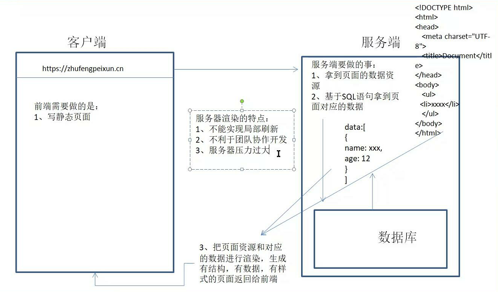
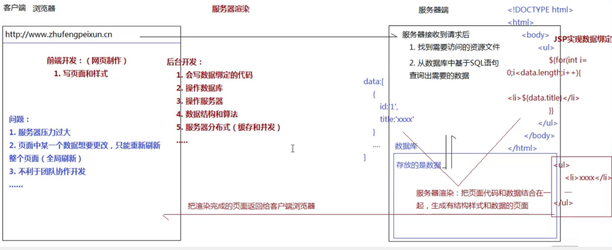
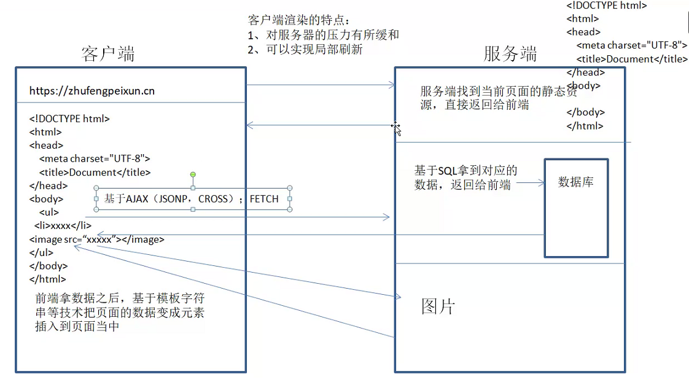
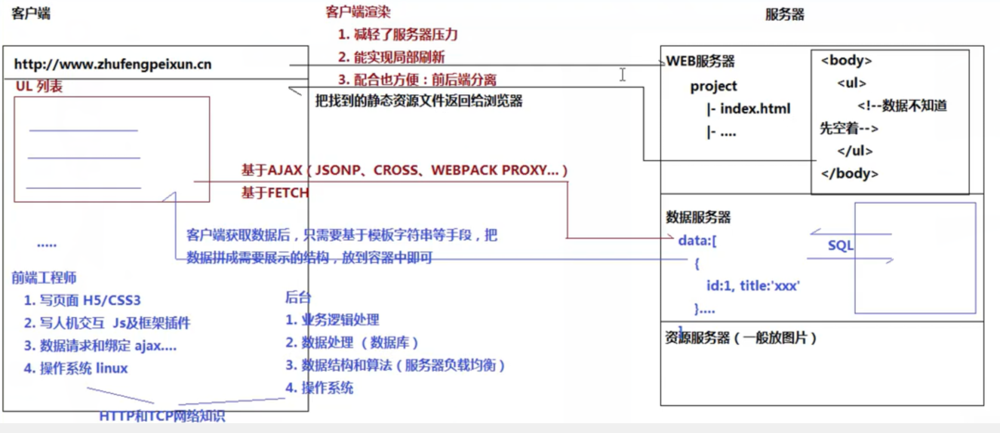

[toc]

# 前端历史与浏览器

## web介绍

- wed1.0：静态页面
- web2.0：动态页面
	1. 弱前端时代：服务端渲染
		- 特点：1.前端只需写网页页面
					 2.只能全局刷新不能实现局部刷新
					 3.不利于团队协作开发
					 4.服务器压力过大 

版本1

版本2

	  
  2. 客户端渲染：
		- 特点：1.减轻服务器压力
					 2.可实现局部刷新
					 3.相较利于团队协作开发（前后端分离）

版本1

版本2

- 前端侵占移动端市场
- node.js 可写后端

## 前端三大核心知识

- HTML   结构
- CSS  样式
- JS  行为 （寄生在浏览器里，也可寄生在服务器上V8(node)）

## 浏览器

> 谷歌（Chrome）、 火狐（FireFox）、 欧朋（Oprea）、IE、safari（苹果）、360、QQ浏览器...

### 内核
- webkit（V8引擎）：谷歌、手机浏览器、国产浏览器（360、qq）	
- Gecko：火狐
- Presto：欧朋
- Trident：IE（EDGE：Chrome mini）

### 控制台
> 吊起控制台：F12或右键检查

- Elements：可以查看、调整页面元素，样式
- Console：可以运行代码，打印输出console的值
- Sources：存放页面所有资源文件
- Network：所有资源请求

