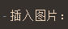

[toc]


# 第一天A模块笔记


## 马克飞象

- 标题：共六级，用#号表示，#号后面需空格。快捷键Ctrl+1~5，代表一至五级标题，第六级Ctrl5+#。
- 加粗：**选中Ctrl+b**
- 斜体：*选中Ctrl+i*
- 分隔线：三个*及以上或三个_及以上，如下
*** 
- 特殊标记：Ctrl+k  如`标记文字`
- 代码块：Ctrl+k 连按三次，如下

```
enter code here
```
- 引用：>+空格，如下
> 引用文章

- 无序列表：+或-加空格生成子列表按Tab，回退上级列表Shift+Tab。若退出列表按两次Enter。
- 有序列表：1. +空格

- 插入图片：①截图直接粘贴。②网络搜图复制图片链接，Ctrl+g粘贴图片链接。③Ctrl+g 插入本地图片


①


- 插入连接：Ctrl+l
[百度](https://www.baidu.com/)

- 最大化编辑区：Ctrl+Enter

- 最大化预览区：Ctrl+Alt+Enter

- 快捷键列表：Ctrl+/

- 生成文档目录：[toc]


## VC code

### 插件

- 汉化：chinese
- 浏览器打开：open in browser

### 基本设置

+ 自动保存：文件--首选项--设置 Files：Auto Safe，下拉选项改为afterDelay ，    1000（毫秒）之后保存，如不设置，需Ctrl+s。
- 设置字体大小：文件--首选项--设置Editor：Font Size。
- 自动折行：Editor：Word Wrap下拉选项改为on。
- 主题颜色：文件--首选项--颜色主题 L开头为浅色，D开头为深色。

### 基本项目内容

- 图片文件夹：images
- css文件夹：专门存放css文件
- js文件夹：专门存放js文件
- index.html

### 快速新建.html文件

- 新建文件 .html (不要建成文件夹)
- 英文输入法下输入! ，然后Enter

## 前端

### 工作流程

- 产品-------UI----web前端--后台---测试---运维
      
- 原型图--效果图-----代码还原---提交测试-上线-在测试-运维（部署）

### 页面所需语言
- html：超文本标记语言，可表示纯文本、音视频。主要指结构（骨架）
- css：层叠样式表，主要用来美化页面（外观样式）
- js：行为动态（动作交互）

### html标签特点
- 关键词用<>括起来
- 成对出现
- 结束标签</ >比开始标签< >多一个/，例如：

```
<p>段落</p>
```

> `大部分标签符合以上标准，但是有例外，如：`

```

```
这类标签称作“单标签”、“自闭和标签”或“空标签”

#### html主要结构

```
<!-- 文档声明 -->
<DOCTYPE html>
<html lang="zh-cn"> 
<!-- 中文网页"zh-cn"，英文用"en" -->
    <head>
        <meta charset="utf-8">
<!-- 国际通用编码"utf-8"，不打可能乱码 -->
        <meta name="keywords" content="网页关键词">
        <meta name="description" content="网页描述">
        <title>网页标题</title>
    </head>
    <body>
        可视编辑区域
    </body>
</html>
```
> 文档声明：Ctrl+/  

### 常用浏览器内核
- 谷歌：原webkit内核 (v8引擎)，现blink内核
- ie浏览器：trident
- 火狐：gecko
- 欧朋：presto
- QQ 360 搜狗等：v8引擎，同谷歌

### 标签
- 标题：共六级，
	- 快捷方式为 `h${标题$}*6+Enter`
```
    <h1>标题一</h1>
    <h2>标题二</h2>
    <h3>标题三</h3>
    <h4>标题四</h4>
    <h5>标题五</h5>
    <h6>标题六</h6>
```

- 段落：
```
<!-- 段落中“& n b s p ;”连一起 相当于空格 -->
    <p>&nbsp;&nbsp;一大段文字</p>
    <p>第二大段文字</p>
```

- 图片
```

```

 - 超链接
```
<a href="链接地址">文字名称</a>
<!-- target="_self"在本页打开（默认）。 -->   
<!-- target="_blank"在新页打开 -->
<a href="http://www.baidu.com" target="_blank">新页百度</a>
```
