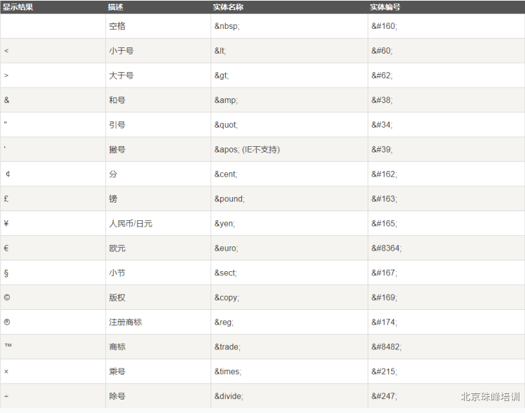
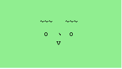
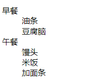

[toc]


## 第二天A模块笔记

### 一个页面所需语言

- html：超文本标记语言，不仅可以表示纯文本，还可以表示音频、视频、图片等。（骨架）
- css：层叠样式表，主要用来美化页面。（外观）
- js：javascript是一个轻量级编程语言，主要是一些业务逻辑、事件、交互等。（行为动作）

### html页面基本结构
```
<!-- 文档声明，不写会怪异 -->
<!DOCTYPE html>
<!-- lang代表语言，en代表英文，zh-cn代表中文 -->
<html lang="en">
    <head>
        <!-- 国际通用编码，不写会乱码 -->
        <meta charset="utf-8">
        <!-- 网页关键词，给搜索引擎看 -->
        <meta name="keywords" content="">
        <!-- 网页描述内容，给搜索引擎看 -->
        <meta name="description" content="">
        <!-- 网页标题 -->
        <title>Document</title>
    </head>
    <body>
        可视区域
    </body>
</html>
```

### html标签
#### 基本特点

- 关键词由尖括号括起来
- 成对出现
- 结束标签比开始标签多一个反斜杠

```
<p>段落</p>
<a href="http://www.链接.com" target="_blank">链接名</a>
<h1>1标题</h1>
<h2>2标题</h2>
```

> 有一类特殊标签，例如：img、br、input等这类标签叫做“**单标签**”、“**空标签**”或者“**自闭和标签**”。
```
<!-- 文字框 -->
<input type="text">
```

#### 标签属性

在开始标签里，除了关键词，其他都是属性，格式为[属性名]=[属性值]，一个标签可以有多个属性，但是`属性之间要用空格隔开`。

```

```


#### 标题

可分为六级，h1~h6，字号由大到小，字体由粗到细，从优化来说重要程度逐层递减。h1最重要，一个页面中通常只出现一次，位置一般在logo部分。

```
//快捷键：h${标题￥}*6
    <h1>标题1</h1>
    <h2>标题2</h2>
    <h3>标题3</h3>
    <h4>标题4</h4>
    <h5>标题5</h5>
    <h6>标题6</h6>
```

#### 段落
p标签
```
<p>大段文字</p>
```

#### 图片
img标签
- src：代表图片路径。
- alt：当图片路径不正确或者网络原因加载失败时会显示其中内容，有利于用户体验。
- title：当鼠标放到图片上时会显示其中内容。（a标签也可用）
```

```
#### 超链接
a标签
- href：跳转页面路径
	- 回到顶部：“#”
	- 禁止跳转：“javascript:;”
	- 锚点跳转：“#”+“id名字”
```
<a href="#">回到顶部</a>
```
```
<a href="javascript:;">禁止跳转</a>
```
```
 <div id="good1">京东秒杀</div>
 <div id="good2">特色优选</div>
 <a href="#good1">京东秒杀</a>
 <a href="#good2">特色优选</a>
```

- target：两个常用属性值
	- _self：在当前窗口打开（默认）
	- _blank：在新窗口打开
```
<a href="路径" target="_self">链接名</a>
```

#### 实体字符




#### 其他标签

- div：大盒子标签，用来划分大区域。
- span：小盒子标签，用来划分小区域。
- 预格式化标签pre：按照预设格式显示内容。
- 格式化标签
	- 加粗：b或者strong（区别：表象相同，strong语气话，语气强烈，利于搜索引擎优化）
	- 斜体：i或者em（区别同上，em语气化）
	- 删除线：del
	- 增大：big
	- 减小：small
```
    <pre>
       ~~~   ~~~
        o  、 o 
           v
    </pre>
```


```
    <b>加粗</b>
    <strong>加粗</strong>
    <i>斜体</i>
    <em>斜体</em>
    <del>删除线</del>
    <big>增大</big>
    <small>减小</small>
```
- 视频：video
- 音频：audio
	- 控制器：controls
	- 自动播放：autoplay
	- 循环播放：loop
```
<video src="212.mp4" controls autoplay loop></video>

<audio src="qt.mp3" controls autoplay loop></audio>
```

### 三大列表

> - 无序列表（unordered list）
	- 固定格式，ul紧邻着li，若嵌套其他标签，可以在li里边写。
```
<ul>
    <li>吃饭</li>
    <li>睡觉</li>
    <li>打鹍鹍</li>
</ul>
```


> - 有序列表（ordered list）
	- 固定格式，ol紧邻着li，若嵌套其他标签，可以在li里边写。
```
<ol>
    <li>吃饭</li>
    <li>睡觉</li>
    <li>打鹍鹍</li>
</ol>
```


> - 自定义列表（defined list）
   - 固定格式，dl后面紧跟着dt或者dd，dt代表列表标题，dd是描述这个标题，若嵌套其他标签可以在dt或者dd里面写。
```
<dl>
    <dt>早餐</dt>
      <dd>油条</dd>
      <dd>豆腐脑</dd>
    <dt>午餐</dt>
      <dd>馒头</dd>
      <dd>米饭</dd>
      <dd>加面条</dd>
</dl>
```


### CSS引入方式
- 行内式
```
<div style="width:500px;height:300px;background:mediumspringgreen;">行内式盒子
</div>
```
- 内嵌式
```
<head>
	<style>
	   div,p{
	      width:300px;
	      height:200px;
	      background:moccasin;
	      margin-bottom:30px;/* 格与格之间下边距 */
	    }   
	</style>
</head>
<body>
	<div> </div>
	<p>   </p>
</body>
```
- 外链式
```
<head>
<link rel="stylesheet" href="index.css">
</head>
```
- 导入式
```
<style>
    @import url("index.css")
</style>
```
- 优先级依次降低

### 标签语义化

用合适标签做合适事情，例如遇到列表用ul、ol、dl，遇到标题用h1~h6，这样有利于搜索引擎搜索，即使样式丢失，但是结构还在。

*.shift+alt+f：格式对齐