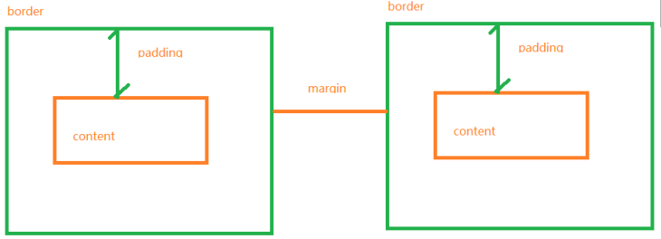
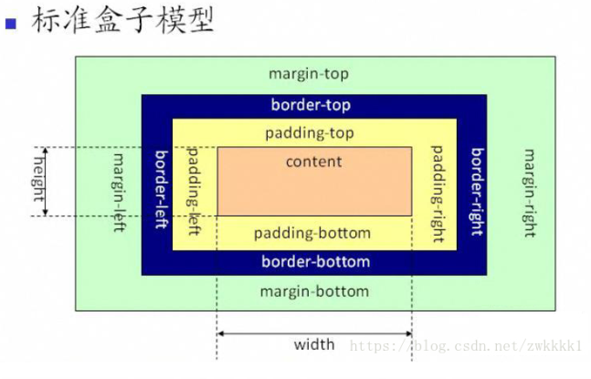
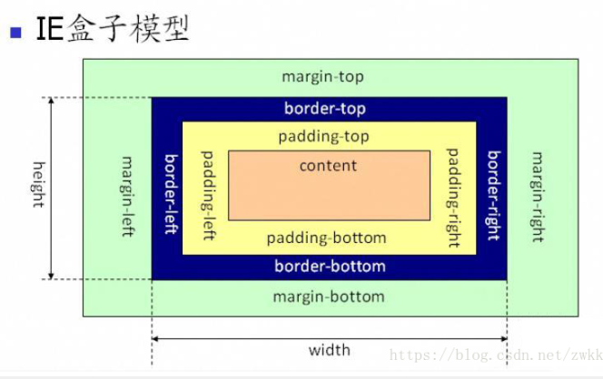

[toc]

## 第五天A模块笔记

### 绝对路径与相对路径
- 绝对路径：电脑硬盘中的具体路径或者网页链接路径，例如：
	- C:\xyz\test.txt 代表了test.txt文件的绝对路径。
	- http://www.sun.com/index.htm 代表一个URL绝对路径。
- 相对路径：相对与某个基准目录的路径。以当前文件为参照，去寻找其他文件。
	- 同级目录：名字
	- 下一级：/
	- 上一级：../；上两级：../../
	
### CSS三大特性

1.  继承性
- 继承是一种规则，它允许样式不仅应用于特定的html标签元素，而且应用于其后代元素。简单说就是给父元素设置一些属性，子元素/后代也可以使用，这个我们称之为继承性。（给父级设置样式属性，他的后代属性都可继承此属性。）

> 具有继承性的元素：color/font-/text-/line-开头的属性、元素可见性：visibility 、以及普通文档中块级元素的宽度是可继承的，但是高度不可继承。

链接：[有继承性的属性罗列](https://blog.csdn.net/qq_41803637/article/details/80023720)
2. 层叠性
- CSS处理冲突的一种能力。通俗的说就是多种选择器选中了同一个元素，又对相同的属性设置了不同的属性值，这个时候就会发生层叠性。（对同一个元素同一个属性设置不同属性值，就会触发CSS层叠性）
- 处理方法看优先级
3. 优先级
- 如果权重相同，下面代码覆盖上面
- 如果权重不同，听权重大的

权重顺序：
！important>内联样式>id>类>标签>通配符>继承>浏览器默认

！important,    强制使用此样式
注意： `尽量少用 !important 和 内联样式`

### 表单元素

- input
	- type="text" 文本
	- type="password" 密码
	- type="reset" 重置（配合form使用）
	- type="submit" 提交
	- type="button" 按钮
		- 按钮文字用属性value="值"
	- type="radio" 单选
	- type="checkbox" 多选
	- 属性：
		- 占位符提示：placeholder
		- 自动获取焦点：autofocus
		- 非空校验：required（配合form使用）
		- 默认选中：checked
		- 禁止选中：disabled
        - 设置最大字符数：maxlength 
		- 选择多个文件（在上传的时候）：multiple
- button 按钮(默认也有提交表单的功能，想要禁止，添加type=“button”这个属性便可以禁止)
	- 鼠标滑上样式显示小手 ：cursor:pointer;
- 文本域：textarea
	- cols：代表列数
	- rows：代表行数
- 下拉框：select
	- 下拉内容：option
	- selected：默认选中
	- disabled：禁用
- 样式
	- 去除input/textarea外面的蓝色线框：outline:none;
	- 禁止textarea拖拽：resize:none;
```
<form action="">
    <!-- 文本输入框;提示文字；自动获取焦点；校验 -->
        <input type="text" placeholder="请输入用户名" autofocus required >
    <!-- 密码输入框 -->
        <input type="password" placeholder="请输入密码" required>
    <!-- 重置,配合form使用 -->
        <input type="reset">
    <!-- 提交 -->
        <input type="submit">
    <!-- 按钮 -->
        <input type="button" value="按钮">
    <!-- 此按钮默认有提交功能，若禁止则在开始标签内加type="button" -->
        <button>按钮</button>
    <!-- 单选 -->
        <input type="radio" checked>
    <!-- 多选 -->
	    <input type="checkbox">
    </form>
	<!-- 文字域（评论框） -->
    <textarea name="" id="" cols="50" rows="18" placeholder="评论50字"></textarea>
	<!-- 下拉列表 -->
    <select name="" id="" >
        <option value="">手机</option>
    <!-- 默认选中 -->
        <option value="" selected>电脑</option>
    <!-- 禁止选中 -->
        <option value="" disabled>平板</option>
    </select>
```

#### 单选功能的实现

把要实现单选功能的一组表单，添加一个相同的name值。
```
<!-- 单选功能实现，取一个相同name值 -->
    <input type="radio" name="sex">男
    <input type="radio" name="sex">女
```
#### 单选功能文字关联

给input起一个id名，用label 标签把文字包括起来，让里面的for属性值和表单上面id名字值一致即可。
```
<!-- 文字关联功能，for与id值相同 -->
    <input type="radio" name="fangxiang" id="zuo">
    <label for="zuo">左</label>
    <input type="radio" name="fangxiang" id="you">
    <label for="you">右</label>
```

### 盒模型

盒模型是一种写网页的思维模式，每个元素都可看成一个盒子，content是盒子里的物品，padding是盒子中的填充物，border是盒子框，margin是盒与盒的距离。
#### 盒模型包含内容
- content：主要内容区域
- padding：元素边框与内容之间的距离（内填充）
- border：元素盒子的边框
- margin：元素与元素之间的距离



#### 计算盒子大小
- 盒子总宽度=content的宽+左右padding+左右border
- 盒子总高度=content的高+上下padding+上下border

#### 盒模型类型
- 标准盒模型：box-sizing:content-box;
- ie盒模型（常用）：box-sizing：border-box; 





#### padding值的顺序
规律：按照顺时针方向，没有设置的方向找对边。（顺序规律适用其他）
```
<style>
   span{
      background:green;
      /*  上、右、下、左 顺时针方向 */
      /* padding:10px 50px 100px 200px; */
      /* 上、左右、下 */
      /* padding:10px 50px 100px; */
      /* 上下、左右 */
      /* padding:10px 50px; */
      /* 四个方向 */
      padding:50px;
      display:inline-block;
      border:5px solid gold;
  }
</style>
```

### 面试题：margin值穿透问题（top存在）及解决办法
当一个大盒子里面包含一个小盒子，大盒子没有设置padding-top或者border-top，我们给里面的小盒子设置margin-top，大盒子会跟随下掉。
- 解决办法
	1. 大盒子设置border-top:1px solid transparent；
	2. 大盒子设置padding-top
	3. 大盒子设置溢出隐藏overflow：hidden；

```
<style>
   .main{
       width:300px;
       height:300px;
       background:green;
       /* 第一种解决办法 边框透明色*/
       /* border-top:1px solid transparent; */
       /* 第二种 */
       /* padding-top:50px; */
       /* padding-top:1px; */
       /* 第三种 溢出隐藏 */
       overflow:hidden;
   }
   .box{
	   width:100px;
       height:100px;
       background:gold;
       margin-top:50px;
   }
```

#### margin值合并问题（垂直方向存在）
描述：有两个兄弟元素：box1，box2垂直排列，我给box1设置margin-bottom:30px; 再给box2设置margin-top:100px; 这两个元素之间的距离并不是两者之和，而是取最大的那个值。（谁大听谁的）