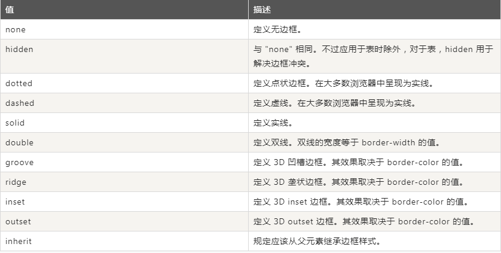
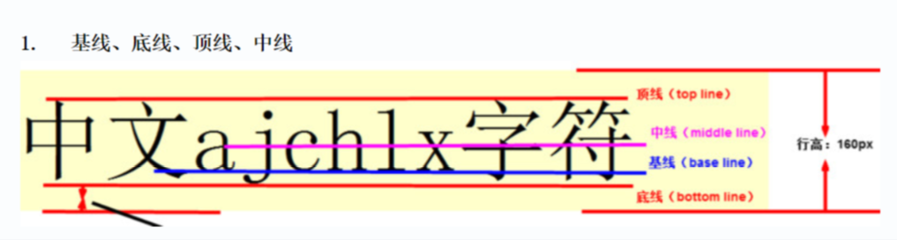
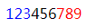
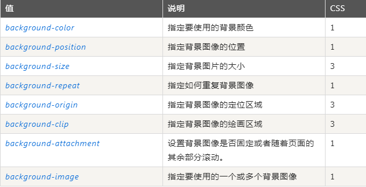

[toc]

## 第六天A模块笔记

### 盒模型知识补充
- min-width：最小宽度
- max-width：最大宽度
- 内填充padding的几个值
	- padding-top
	- padding-right
	- padding-bottom
	- padding-left
- 外边距margin（方向同内填充）
- 外边界border(一般用复合属性border:2px solid lime;)
	- border-width
	- border-style
	- border-color




### 两个块级元素在一行显示问题
#### 两个盒子之间缝隙
> 把两个块级元素转换成行内块，但是结构中出现了`换行`，浏览器渲染时，两个盒子之间会出现缝隙。

 解决办法
- 消除结构中的换行符
- 给这两个元素的父级添加font-size:0; 如果这两个元素中还有文字，可以单独给这两个元素设置文字大小。

#### 写文字后元素对齐问题
> 在上面前提下，在其中一个盒子里写文字，另一个没写，会产生下掉情况



解决办法
- 改变对齐的方式。
```
/* 顶线对齐 */
vertical-align: top;
/* 中线对齐 */
vertical-align: middle;
/* 底线对齐 */
vertical-align: bottom;
/* 默认基线对齐 */
vertical-align: baseline;
```

### 浮动
#### 浮动的值
- 左浮动：float:left;
- 右浮动：float:right;
- 不浮动（默认）：float:none;
#### 浮动特点
- 浮动的元素脱离正常文档流，不占位置。
- 元素浮动方向针对父级（相对父级元素）。
- 块级元素浮动后宽度不可继承，由自身内容决定，或者单独设置宽度。
- 行内元素设置浮动后，写宽高也起作用。
- 浮动的本质：最初是为了实现图文混排，场景：有一张图片，一些文字，如果给图片设置浮动，文字就会环绕图片进行排列。

### 面试题：浮动造成父级元素“盒子塌陷”问题
- 给浮动元素父级设置高度
- 给浮动元素父级设置overflow:hidden;（溢出隐藏）
- 给浮动元素父级盒子的末尾添加标签，然后给这个标签设置样式：clear:both;
	- clear:left; 清除左浮动造成的影响
	- clear:right; 清除右浮动造成的影响
	- clear:both; 清除左右浮动造成的影响
- 在项目中，直接把下面的clearfix样式粘贴到你的css中，哪个元素浮动，就给父级增加clearfix这个类名。（它的本质和第三种方法是一样的）

```
.clearfix:after {
    display: block;
    height: 0;
    content: "";
    clear: both;
    overflow:hidden;
    visibility:hidden;
    font-size:0;
}
.clearfix{
    *zoom:1
}
```

### 伪元素
并非真的在结构中添加元素，而是通过样式在结构中增加元素。
注：再用伪元素的时候即使里面没又内容，也要加上`content:"";`。
```
<STYLE>
p::before{
        content:"123";
        color:blue;
    }
p::after{
        content:"789";
        color:red;
    }
</STYLE>
<p>456</p>
```


### 面试题：用代码制作三角形

```
div{
    border:100px solid blue;
    border-color:brown lawngreen darkorange dimgray;
    width:0;
}
```

### overflow常用值
- 超出隐藏：overflow:hidden;
- 根据情况自动添加滚动条：overflow:auto;
- 始终添加滚动条：overflow:scroll;

### background常用值
- 背景颜色：background-color:
- 背景图片：background-image:url("");
- 背景图片位置：background-position:x轴 y轴;
	- 英文单词：
		- 水平方向：left、center、right；
		- 垂直方向：top、center、bottom
	- 具体像素值
	- 百分比
- 背景图片大小：background-size:width height；
	- 具体像素值，如background-size:50px 60px;
	- 百分比，如background-size:100% 100%;
	- cover，使背景图片铺满整个盒子，有时部分内容会超出盒子范围。
	- contain，以最合适大小显示，放大时只要一边触碰盒子，就停止。
- 背景图片重复方法：background-repeat:
	- repeat：平铺（默认值）
	-  no-repeat：不平铺
	-  repeat-x：沿x轴平铺
	-  repeat-y：沿y轴平铺
- 背景图滚动：background-attachment:
	- fixed：背景图固定，不随其他板块滚动
	- scroll：背景图随其他板块滚动而滚动（默认）

了解内容：
- 背景图片定位区域（起始位置）background-origin:（测试时加上no-repeat）
	- border-box：从边框区域开始
	- padding-box：从padding区域开始
	- content-box：从content区域开始
	- 注意：如果背景图像background-attachment是"固定"，这个属性没有任何效果。
- 背景裁剪（超出部分裁剪）：background-clip:
	 - border-box；（默认值） 超出边框的部分裁剪掉
	 - padding-box；超出padding部分的裁剪掉
	 - content-box;   超出content 部分的裁剪掉

> background-origin  和background-clip 的区别？
background-origin 指的是背景图片从什么地方开始，而background-clip是把相应部位之外的内容去除后显示。


