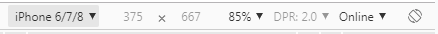
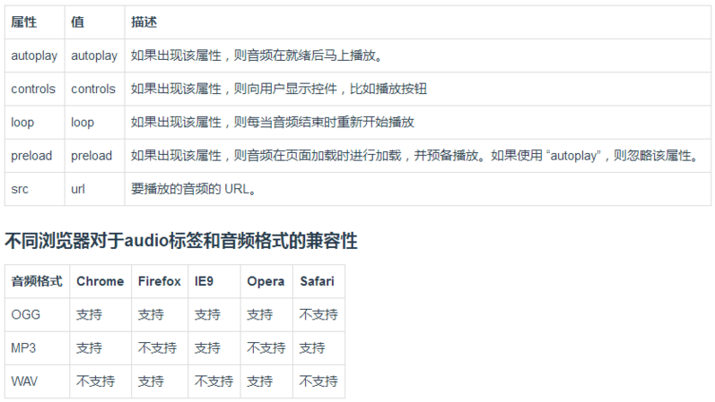
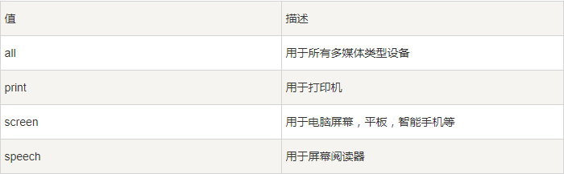

[toc]

## 第十二天A模块笔记

### 产品形态

1. PC端移动端共用一套：
- 华为：https://www.huawei.com/cn/?ic_medium=direct&ic_source=surlent
- 苹果：https://www.apple.com/cn/

2. PC端移动端各一套：
+ 京东pc：https://www.jd.com/  
+ 京东移动： https://m.jd.com/
+ 小米pc：https://www.mi.com/
+ 小米移动：https://m.mi.com/

#### 使用时机
当网页结构比较复杂的时候，通常写两套；当网页结构比较简单的时候，可以写一套。

#### 两者区别

1. 事件上：PC端使用鼠标，所以有点击、滑过等鼠标相关事件；移动端时用手指，所以有滑屏、右滑等手指相关事件。
2. 浏览器兼容性：PC端需考虑浏览器兼容性的问题（每个浏览器内核不同，所以会有差异）；移动端不需要考虑，因为它内核与谷歌一致（webket）。移动端需考虑屏幕适配问题，机型不同也会出现兼容性问题

#### 设计稿的尺寸

> 参考手机屏幕的宽度×设备像素比
- 640x1136的宽度(单屏的页面)?参照iphone5手机分辨率:320*2
- 750x1334的宽度(单屏的页面)?参照iphone6手机分辨率:375*2（较多）
- 1242  2208的宽度(单屏的页面)?参照iphone6plus?手机分辨率:4143


### HTML5

> H5其实是移动端的一个统称

> HTML5 -> H5 -> 移动端

> HTML5是HTML最新的修订版本，2014年10月由万维网联盟（W3C）完成标准制定。

> HTML5的设计目的是为了在移动设备上支持多媒体。

> HTML5 是下一代 HTML 标准。

> HTML , HTML 4.01的上一个版本诞生于 1999 年。自从那以后，Web 世界已经经历了巨变。

> HTML5 仍处于完善之中。然而，大部分现代浏览器已经具备了某些 HTML5 支持。

> SEO 使用HTML5的新添加的标签可以有助于SEO优化，目的就是让页面更有语义化

#### H5 新增标签

- header ：头部
- footer ：底部
- main ：主题
- nav ：导航
- aside ：侧边栏
- article ：文章
- section ：块
- figure ：配图
	- figcaption ：配图说明
- video ：视频
	- controls ：控制台
	- autoplay ：自动播放
	- loop ：循环播放
	- preload ：预加载
    - source 兼容多个多个音频视频格式的配置

```
    <audio controls>
        <source src="horse.ogg" type="audio/ogg">
        <source src="horse.mp3" type="audio/mpeg">
    </audio>
```

- audio ：音频
- canvas 画图的（位图）
- svg  矢量图

### audio兼容性处理

为了兼容多个浏览器，我们需准备三种格式音频，浏览器加载时，代码从上往下执行，如果第一种格式支持，则停下，如不支持继续向下寻找。（移动端只需考虑谷歌支持即可）
```
<audio >
        <source src="--/--/1.ogg"/>
        <source src="--/--/1.mp3"/>
        <source src="--/--/1.wav"/>
    </audio>
```

### H5新增表单元素

```
    <!-- 数字 -->
    <input type="number" name="" id="">
    <!-- 搜索 -->
    <input type="search" name="" id="">
    <!-- 时间 -->
    <input type="time" name="" id="">
    <!-- 电话拨号 -->
    <input type="tel" name="" id="">
    <!-- 颜色面板 -->
    <input type="color" name="" id="">
    <!-- 范围 -->
    <input type="range" name="" id="">
    <!-- 文件 -->
    <input type="file" name="" id="">
    <!-- 日期 -->
    <input type="date" name="" id="">
    <!-- 邮件 -->
    <input type="email" name="" id="">
```

### css3需要增加的私有前缀

```
-webkit-border-radius:50%; //谷歌
-moz-border-radius:50%;    //火狐
-ms-border-radius:50%;     //ie
-o-border-radius:50%;      //欧朋
border-radius:50%;      //标准写法
```

移动端只用写-webkit 和标准即可

### 阴影

```
.sun{
    height:100px;
    width:100px;
    background:lightblue;
    margin:100px 100px;
    border-radius:50%;
    -webkit-border-radius:50%;
    -moz-border-radius:50%;
    -ms-border-radius:50%;
    -o-border-radius:50%;
    /* 阴影：X轴偏移量 Y轴偏移量； 模糊度 半径大小 颜色； inset：内阴影 不写为外阴影outset */
    box-shadow:1px 2px 10px 5px lightslategray,0 0 0 10px lime,0 0 0 20px lightcoral,0 0 0 35px lightseagreen;
}
```

```
p{
  text-shadow:3px 0px 1px rgb(108, 146, 146);
  font-size:30px;
}
```

### 渐变

- 渐变可以分为两种：
1. 线性渐变（Linear Gradients）
2. 径向渐变（Radial Gradients）

- 线性渐变 
默认从上到下

```
.box{
	background:linear-gradient(red,green);
	background:-webkit-linear-gradient(red,green);
}
```
· 从一个方向到另一个方向（left 、right 、bottom、top）
```
background:linear-gradient(left,red,green);
background:-webkit-linear-gradient(left,red,green);
```
· 对角的，两个方向可以进行组合，比如从左上角到右下角
```
background:linear-gradient(left top,red,green);
background:-webkit-linear-gradient(left top,red,green);
```
· 还可以是角度
```
background:linear-gradient(90deg,red,green);
background:-webkit-linear-gradient(90deg,red,green);
```
- 径向渐变：
默认的形状是椭圆，至少得有两个颜色值。 
- 形状：ellipse 椭圆（默认），circle（圆）
- 宽高相同时则为圆形。

```
.box{
     width:400px;
     height:600px;
     margin:0 auto;
     background:radial-gradient(circle,red,green);
     background:-webkit-gradient(circle,red,green);
}
```

### 视口：viewport

在写移动端时，必须加上视口，因为移动端中，body默认宽度为980px，如果想要完全在手机设备中显示，就会缩放。这样会使里面元素变小。为避免这种情况，我们需要加上视口。

#### 视口内容

快捷键：meta:vp +Enter
```
<meta name="viewport" content="width=device-width, user-scalable=no, initial-scale=1.0, maximum-scale=1.0, minimum-scale=1.0">
```

- name="viewport" 视口
- content="width=device-width, 页面宽度等于设备宽度
- user-scalable=no, 用户缩放不允许
- initial-scale=1.0, 初始缩放值1.0
- maximum-scale=1.0,  最大缩放值1.0
- minimum-scale=1.0, 最小所放置1.0

### 媒体查询

作用：根据不同媒体，根据特定条件，设置特定而样式规则。

语法：

```
media not|only mediatype and (expressions) { CSS 代码...; }
```

```
/* max-width:600px;此样式宽度最大值为600px，即宽度小于等于600px时为此样式 */
media screen and (max-width:600px){
     div{
         background:orangered;
     }
}
@media screen and (min-width:601px) and (max-width:799px){
      div{
          background:slateblue;
      }
}    
@media screen and (min-width:800px){
      div{
          background:palegreen;
      }
}    
```

- ‘@media 媒体、媒介
- 关键字
	- not 排除某种设备
	- only 只对某种设备
- mediatype 媒体类型
- (expressions) 判断条件
- { CSS 代码...; } 符合判断条件时的样式

> 注：and前后必须有空格

媒体类型：


### rem

rem 是一个长度单位，是html页面中根元素(html)的字体大小。我们页面中所有的元素无论是字体大小还是宽、高都可以用rem来表示。一旦当前页面中html的字体大小改变，页面中只要用到rem单位的元素都会被改变，所以在不同的设备中，我们手机屏幕不一样，所需要改变的尺寸也不同，我们只需要在不同的屏幕中，更改页面中根元素的大小即可实现响应式，但是通常我们还需要配合媒体查询、flex布局、百分百等

rem 是指根元素（root element）的字体大小。根元素就是我们所说的html元素，默认的情况下，根元素字体的字体大小是16px;
那我们做移动端的响应式开发，如果纯粹用之前所说的媒体查询，那么我们的代码就会很多，写起来也不是很方便。那么怎么办呢？ 我们就可以结合我们的rem。
rem做移动端的思想？ 当我们拿到设计稿的时候，如果可以按照设计稿的尺寸去写，然后如果可以通过更改一个值，就能更改页面中所写的css，那是不是会很方便，rem刚好就是。 1rem=html的字体大小（默认情况下是16px）；
如果我们随着移动端屏幕的改变，然后改变下html的字体大小，就可以达到刚才的目的。
屏幕的宽度/设计稿的尺寸=x/100; 根据这个计算公式我们是不是可以算出移动端屏幕改变时候的根元素应该具有的字体大小。

```
function refreshRem() {
        var desW = 640,
            winW = document.documentElement.clientWidth||document.body.clientWidth;
            ratio = winW / desW;
        document.documentElement.style.fontSize = ratio * 100 + 'px';
    }
    refreshRem();
    window.addEventListener('resize', refreshRem);
```