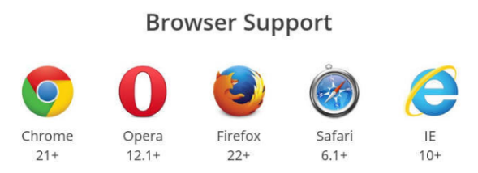
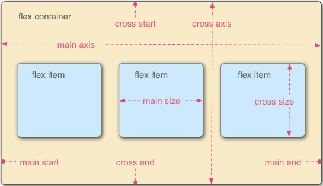
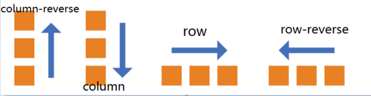
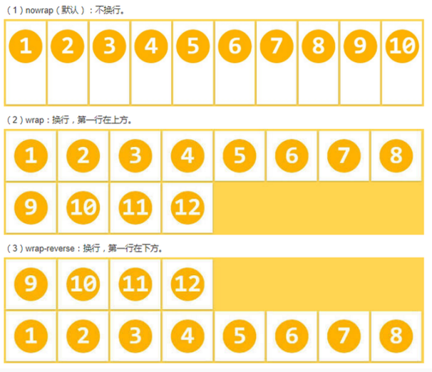
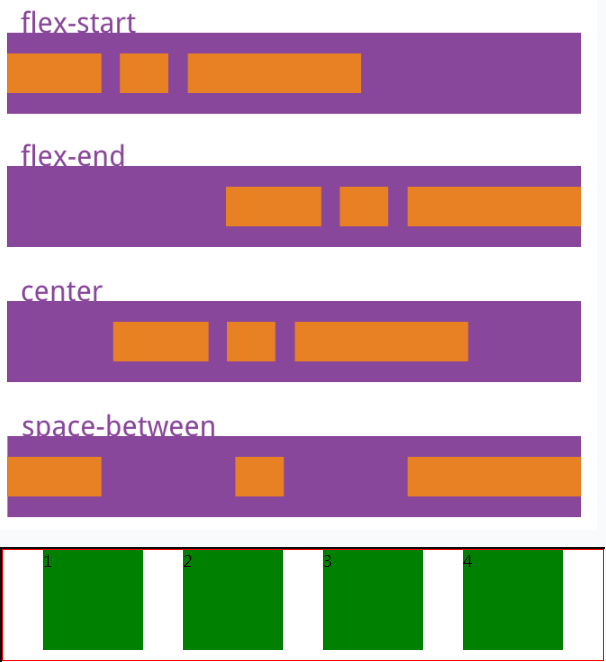
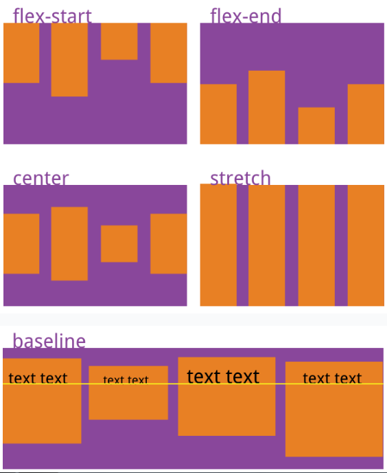
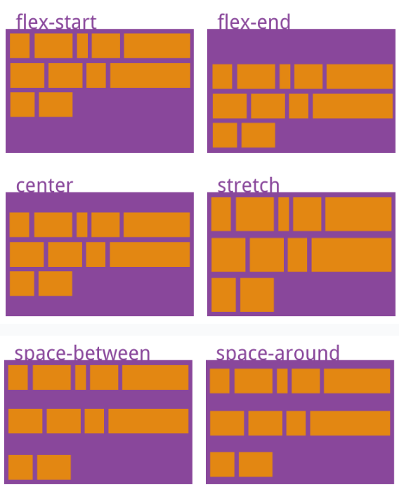
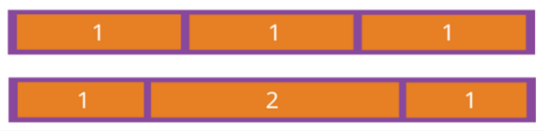
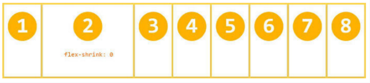
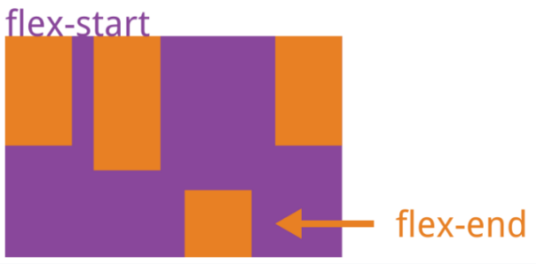

[toc]

## 第十四天A模块笔记

### flex布局

> 弹性盒模型: 布局的传统解决方案，基于盒状模型，依赖 display属性 + position属性 + float属性。它对于那些特殊布局非常不方便，比如，垂直居中就不容易实现。
> 2009年，W3C提出了一种新的方案—-Flex布局，可以简便、完整、响应式地实现各种页面布局。

#### 兼容性
> 注意：设为Flex布局以后，子元素的float、clear和vertical-align属性将失效。
>  使用方便，PC端一不定兼容，移动端基本兼容。




#### 定义

Flex是Flexible Box的缩写，意为“弹性布局”，用来为盒状模型提供最大的灵活性。
任何一个容器都可以指定为Flex布局。flex 布局有两个值：
- display:flex; 代表的是块级
- display:inline-flex; 代表的是行内块

#### 基本概念

1. 采用Flex布局的元素，称为Flex容器（flex container），简称”容器”。它的所有子元素自动成为容器成员，称为Flex项目（flex item），简称”项目”。
2. 容器默认存在两根轴：水平的主轴（main axis）和垂直的交叉轴（cross axis）。主轴的开始位置（与边框的交叉点）叫做main start，结束位置叫做main end；交叉轴的开始位置叫做cross start，结束位置叫做cross end。




#### 容器属性

1. flex-direction属性: 设置主轴的方向
- row：主轴的方向是水平，从从左到右
- column：主轴的方向是垂直的，从上到下
- row-reverse：主轴的方向是水平，从右到左
- column-reverse：主轴的方向是垂直的，从下到上




2. flex-wrap:
- wrap: 换行
- nowrap: 不换行（默认）
- wrap-reverse：换行，不过第一行在最下面




3. flex-flow 
	- flex-flow属性是flex-direction属性和flex-wrap属性的简写形式，默认值为row nowrap。
例如：flex-flow:row wrap;为主轴水平，换行

4. justify-content属性定义了项目在主轴上的对齐方式。 
- justify-content: flex-start | flex-end | center | space-between | space-around| space-evenly;




5. align-items属性：align-items属性定义项目在交叉轴上如何对齐。 
- align-items: flex-start | flex-end | center | baseline | stretch;
- stretch（默认值）：如果项目未设置高度或设为auto，将占满整个容器的高度。




6. align-content属性 
- align-content属性定义了多根轴线的对齐方式。如果项目只有一根轴线，该属性不起作用。（也就是说得有flex-wrap:wrap;）
- align-content: flex-start | flex-end | center | space-between | space-around | stretch; 

> 下图中表示子元素的框有默认边距




#### 项目的属性

以下6个属性设置在items上。
1. order属性定义项目的排列顺序。数值越小，排列越靠前，默认为0。负值靠前，正直往后。
```
order:5;
```
2. flex-grow属性 
- flex-grow属性定义项目的放大比例，默认为0，即如果存在剩余空间，也不放大。 
- 如果所有项目的flex-grow属性都为1，则它们将等分剩余空间（如果有的话）。
- 如果一个项目的flex-grow属性为2，其他项目都为1，则前者占据的剩余空间将比其他项多一倍。


3. flex-shrink属性 
- flex-shrink属性定义了项目的缩小比例，默认为1，即如果空间不足，该项目将缩小。
- 如果所有项目的flex-shrink属性都为1，当空间不足时，都将等比例缩小。
- 如果一个项目的flex-shrink属性为0，其他项目都为1，则空间不足时，前者不缩小。
- 负值对该属性无效



4. flex-basis属性 
- flex-basis属性定义了在分配多余空间之前，项目占据的主轴空间（main size）。
- 浏览器根据这个属性，计算主轴是否有多余空间。
- 默认值为auto，即项目的本来大小。它可以设为跟width或height属性一样的值（比如350px），则项目将占据固定空间。

5. flex属性 
- flex属性是flex-grow, flex-shrink 和 flex-basis的简写，默认值为0 1 auto。后两个属性可选。
- 常用：flex:1;  即items平均分布；

6. align-self属性 
- align-self属性允许单个项目有与其他项目不一样的对齐方式，可覆盖align-items属性。默认值为auto，表示继承父元素的align-items属性，如果没有父元素，则等同于stretch。

```
.item {
align-self: auto | flex-start | flex-end | center | baseline | stretch;
}
```


