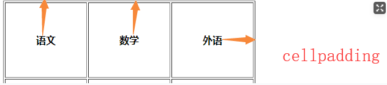
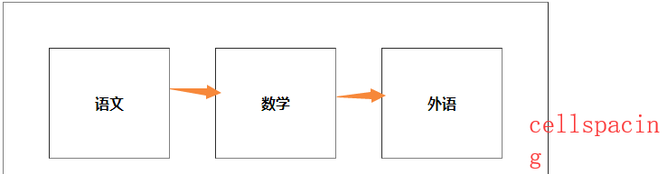

[toc]

## 第四天A模块笔记

### 选择器

- 选择器权重：
```
!important： 10000
style(行内)： 1000   
id：         100   
类、伪类：    10
元素、伪元素： 1

通用选择器（*）、子选择器（>）、相邻选择器（+）、同胞选择器（~）、权重值为0 

!important(10000) >  style(1000) > #(100) > 类，伪类(10) > targe，伪元素(1) > *+~ (0)
```

#### 1. 通配符选择器

- 权重：0
- 符号：*
```
* {
   background:red;
}
```

#### 2.标签选择器

- 权重：1
- 符号：标签{ }
- 代表会对这一类标签都起作用

#### 3.类选择器
- 权重：10
- 起名字：在开始标签里写class="名字"
- 选取：`.`+[名字]
```
.ppp{
    background-color:yellow;
}
```

#### 4.属性选择器
- 权重：10
- 符号：[]
- 用法
	- 1、[属性名]{}，代表把具有这一类属性的标签全选中。
	- 2、[属性名="属性值"]{}，代表把具有这一属性并且属性等于这一属性值的标签选中。
```
[index]{
    background-color:green;
}
[index="a1"]{
    background-color:red;
}
```

#### 5.id选择器
- 权重：100
- 起名字：开始标签里id="名字"
- 选取：`#`+"名字"

id选择器和class选择器不同，id=“name1” 是唯一的，这个是规定。例如在页面中写了一个id=“name1”，那么这个页面中不允许出现第二个id=“name1”。
```
#p1{
    background-color:lightsalmon;
}
```

#### 6.子选择器
- 权重：选择器组合之和
- 符号：>
- 代表选中特定容器中的“儿子”元素
```
div>h3{
    background-color:red;
}
```
> 选择内嵌在div内的h3

#### 7.后代选择器
- 权重：选择器组合之和
- 符号：空格
- 代表选中特定容器中的“儿子”或者“”孙子等元素，只要是包含关系都能被选中。
```
div span{
    background-color:saddlebrown;
}
```

#### 8.分组选择器
- 权重：组合的选择器之和
	- 如下： .box1>p1权重11，.box权重10
- 符号：，
- 用处：可以把具有相同样式的代码提取出来

如下：.box1>p1 和.box2 具备同样的样式
```
<style>
.box1>p1,.box2{
       color:darkorange;
       width:100px;
       height:100px;
       background:green;
}
</style>
	<div class="box1">
	<p>p1</p>
	</div>
	<p class="box2">box2</p>
```

#### 9.交集选择器
- 权重：选择器之和
- 符号：无
- 用处：把具有多个选择器（名字）的元素选中
```
<style>
   .box1.current{
       background:green;
	}
</style>
<div class="box1 current" >box1</div>
<div class="box1">box1</div>
<p class="current">p1</p>
```

#### 10.相邻兄弟选择器
- 权重：选择器之和
- 符号：+
- 用处：用来选取特定元素相邻的特定兄弟元素

注：向下选取一个；不选上，不选向下第二的；后面再加个p则选第二个不选第一个。
如下p1为绿色。
```
<style>
	 h1+p{
     background:green;
     }
</style>
	<p>p</p>
	<h1>h1</h1>
	<p>p1</p>
	<div>box1</div>
	<p>p2</p>
	<h1>h1</h1>
	<div>div1</div>
	<h1>h1</h1>
	<p>p1</p>
	<p>p2</p>
```
#### 11.通用兄弟选择器
- 权重：选择器之和
- 符号：~
- 用处：用来选取特定元素相邻的所有兄弟元素

注：向下选取所有；不选上
如上p1、p2为绿色。

#### 12.伪类选择器
> a标签的四种状态，它这四种状态有一定的顺序，在网络上被称为“爱恨原则（l v   h a）”。
> 重点记住：hover 即可，其它几个不兼容。
```
<style>
        a{
            font-weight: bold;
            font-size:100px;
        }
        /* 默认链接的文字颜色 */
       a:link{
           color:green;
       }
       /* 访问过后的文字颜色 */
       a:visited{
           color:gold;
       }
       /* 鼠标滑上 */
       a:hover{
           color:hotpink;
       }
       /* 点击链接时候的 */
       a:active{
           color:darkcyan;
       }
</style>
```

### 表格：table
- table 表示整个表格
- caption 表示表格的标题 
- tr 表示每一行
- td 表示每一个单元格
- th 表示的是表头（跟td一样，只是更加有语义化，文字加粗）

#### 完整表格：
```
<!-- table 起名字 边框宽度 内容距边框距离 内单元格之间距离 -->
<table class="tb1" border="8" cellpadding="20" cellspacing="10">
    <caption>成绩表</caption>
    <thead>
        <tr>
            <th>语文</th>
            <th>数学</th>
            <th>外语</th>
        </tr>
    </thead>
    <tbody>
        <tr>
            <td>100</td>
            <td>99</td>
            <td>98</td>
        </tr>
        <tr>
            <td>98</td>
            <td>97</td>
            <td>96</td>
        </tr>
    </tbody>
    <TFOOT>
        <tr>
            <th>总分</th>
        </tr>
     </TFOOT>
</table>
```
#### 简单表格：
```
<table class="tb2" border="2">
    <tr>
        <th>物理</th>
        <th>化学</th>
        <th>生物</th>
    </tr>
    <tr>
        <td>88</td>
        <td>95</td>
        <td>90</td>
    </tr>
    <tr>
        <td>总分</td>
    </tr>
</table>
```
> 完整版更加具有语义化，更利于搜索引擎优化；此外完整版中即使调换thead、tbody、tfoot的顺序，浏览器渲染页面时，还是按照正常顺序。

#### table属性

- 合并行：rowspan（跨行数）
- 合并列：colspan（跨列数）

```
<tr>
    <!-- 合并3列，需删除被合并的列 -->
    <td colspan="3">66</td>
    <!-- <td>77</td> -->
    <!-- <td>88</td> -->
</tr>
<tr>
    <!-- 合并2行，需删除被合并的行 -->
    <td rowspan="2">66</td>
    <td>77</td>
    <td>88</td>
</tr>
```

- 单元格中内容到边框的距离（内填充）：cellpadding



- 单元格与单元格间距：cellspacing



```
<!-- table 起名字 边框宽度 文字距内边框距离 内表格距外边框距离 -->
<table class="tb1" border="8" cellpadding="10" cellspacing="20">
</table>
```

#### 表格样式

- 合并边框线：border-collapse:collapse;
		- （边界崩溃）
- 表格布局平均分布：table-layout:fixed;

```
.tb1
 {
     /* 合并边框线 */
     border-collapse: collapse;
     /* 平均分布（前提是有宽度） */
     table-layout: fixed;
     width: 400px;
     margin-bottom: 10px;
}
```