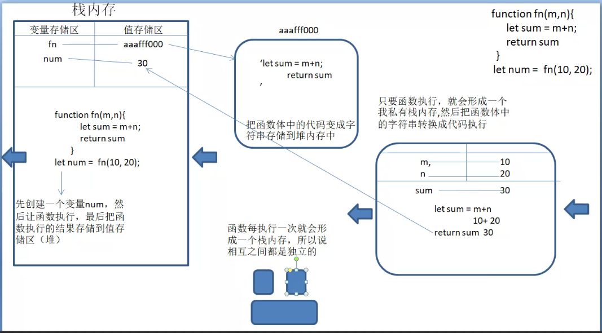

[toc]

## 运算循环判断函数

### 四则运算

- 四则运算包括加减乘除，除了加法，其他都是正常科学计算。
- 运算中出现了不是数字类型的值，先把值转换为数字类型再运算。（`可利用运算转数字`）
- **`加法`**有可能出现字符串拼接，如果在加法中出现了字符串，那就会变成字符串拼接。
	- 加法运算中将不是数字的值进行转换时，转换过程中`出现字符串就直接拼接`，如普通对象及数组。（普通对象与数组转换数字过程中，需先转换为字符串，但是运算时碰到字符串就拼接，所以数组与普通对象转换数字时，转到字符串就停止）
	- 拼接过程中，如果有基本数据类型就直接拼接；引用数据类型如数组或者普通对象，要转数字（转到字符串就停止，直接拼接）。
- `运算过程中`出现NaN，结果就是NaN（`NaN`与`任何数字`运算，结果都是NaN），但是加法中碰见字符串后会转为拼接过程。

```
console.log('10' + 10) // '1010'
console.log( +'10' ) // 10(数字类型的)
console.log('10' - 10) // 0
console.log('10px' - 10) // NaN
console.log( [] + []) // => '' + []=> '' + ''=>''
console.log('12px'*0) // NaN
console.log([] + false) // ''+ false=>'fasle'

console.log([31415926] + {name: 31415926})
// '31415926'+ '[object Object]'=>'31415926[object Object]'

console.log(1 + null + false + '珠峰' + [] + null + undefined)
// 1+0 =>1+0=>'1珠峰'=> '1珠峰' =>'1珠峰null'=>'1珠峰nullundefined'

console.log(1 + true + [] + false + [12] + null)
// 1+ 1=>2+ ''=>'2false'=>'2false12'=>'2false12null'

console.log(undefined+1+null+false+'珠峰'+[]+null)
// NaN+1=>NaN+0=>NaN+0=>NaN+'珠峰'=>'NaN珠峰'+ ''=>'NaN珠峰' + null=> 'NaN珠峰null'
```

### 逻辑运算符

- % ：取模（取余数）
- i++/i- - ：先取值，后运算（转数字再运算，不拼接）
- ++i/--i ：先运算，后取值（转数字再运算，不拼接）
- +=/-= ：a += b ==> a = a + b
- ! ：非
- || ：或（运行机制：如果前边转布尔是false，则取后边的值，反之取前边的）
	- 遇到true就返回；
- && ：与（如果前边转布尔是true，则取后边的值，反之取后边的）
	- 遇到false就返回；
- 运算优先级：! > && > ||
```
let c = 5;
	c = c%2; // 5除以2商2余1
console.log(c); // 1
let a = 2;
    b = a++; // b=a,a=a+1
console.log(a);//3
console.log(b);//2
let m = 4;
    n = ++m; // n=m+1,m=m+1
console.log(m);//5
console.log(n);//5
let x = 3;
    x += 2 ; // x=x+2
console.log(x); // 5
```

### 展开运算符（ES6）

- 展开运算符(...) 允许一个表达式在某处进行“展开”，即多个参数(函数调用)或多个元素(数组)或多个变量(解构赋值)的地方进行使用。
- 展开运算符只可用在数组等可遍历元素中。

```
        // 收缩（展开）运算符(ES6)
        let fe=(...a)=>{
            //收缩运算符（形参中收缩）
            console.log(a); // [{…}, 2, 3, 4]
            //展开运算符
            console.log(...a); // {} 2 3 4
            console.log(...[5,{n:6},7]);  //5 {n: 6} 7
        }
        fe({},2,3,4)
        // 收缩数组剩余项
        let xx=null;
        [x1,x2...xx] = [1,2,3,4]
        console.log(xx); //[3,4]
        //展开数组
        let x3=[1,2,3,4]
        console.log(...x3); // 1 2 3 4
```

### js操作语句（循环、判断）

- if/else ：判断（可嵌套if/else）
- 三元运算符
- switch case

#### if/else

- 判断条件会转布尔，如果有一个条件成立（true），别的条件不管成立不成立都不再执行。若都不成立（false），则执行最后的else
- 判断条件不能空

```
if(判断条件，true则执行，false则向下执行else){
	
}
else if(判断条件，true则执行，false则向下执行else){

}
else{

}
```

#### 三元运算符

- 组成结构：判断条件? 条件成立执行的程序:条件不成立执行的程序（条件不成立不需执行程序可用占位符null，但不能空着）
- 如果处理事情较多，可以用括号括起来，事情之间用逗号分隔。
```
let a = 5;
a = 6? console.log('对') : console.log('错')
// 判断A?(A对判断B?B对执行,B对执行:B错执行):A错执行;
```

#### switch case

- switch case判断方法：全等（===）
- 每一个case后需要break来阻断代码执行，否则不管条件成立不成立下边代码都会执行。
```
switch(val){
	case 1:  // val === 1
		console.log(1)
		break; // 拦截代码执行，没有的话不管成立不成立下边都执行（代码穿透）
	case 2:
		console.log(1)
		break;
	default:  // 同else
		console.log('背锅侠')
		break; //可有可无（无代码可穿透）
}
```

#### 循环

> 重复的做某件事

- for
- while
- for in
- for of(ES6)

##### for

- 一般遍历数组、类数组或字符串用for循环（知道length并且知道结束点）
- 1.创建循环的初始值
- 2.设置（判断）循环执行的条件
- 3.执行循环体中的内容
- 4.当前轮循环结束，进行步长累计操作
- continue：结束当前轮循环（continue后面的代码不执行，返回累计，继续下轮循环）
- break：结束整个循环（break后面的不在执行）

```
 for (var i = 0;i<4;i++){
      console.log(i);  // 0 1 2 3
 }
 console.log(i);  // 4
 
for(var j = 0;j<4;j++){
      if(j===2){
          break
      }
      console.log(j);  // 0 1 
}
console.log(j);  // 2 

for(var k = 0;k<4;k++){
      if(k===2){
	     console.log(k);  // 2
         continue;
      }
      console.log(k);  // 0 1 3 
}
console.log(k);  // 4
```

##### for in

- 一般用于遍历对象
- 性能较低（枚举时会枚举到原型链上的自定义属性）
- key:自定义的变量，代表对象的属性名，而且是字符串类型
- 有多少键值对，就循环几次
- 在for in循环中，获取属性名对应的属性值只能用“对象名[属性名]”的形式获取
- 如果属性名是数字，就会按照从小到大的顺序在前面输出。
```
let per = {
    name:'xxx',
    age:18,
    fire:9000,
    girlFriend:'none',
    3:'22',
    1:'33'
}
for(var key in per){
   // console.log(key);
    console.log(per[key]);
}
```

##### while

- 一般用于不知道输出多少次，不知道具体条件的循环

```
var i = 0;
while(i<5){
    i++
    console.log(i); 
}
//无限循环
var i = 1;
while(i>0){
    i++
    console.log(i); 
}
```

### 函数

> 函数就是一个方法或者功能体，他把实现一些功能的代码封装到一起，如果以后需要这个功能，就执行函数就可以（可减少重复代码，提高代码复用率）【高内聚低耦合】

- 函数: (最大的用处就是复用) 重点、难点
	-  难点(参数、返回值):
                单拎出来简单，混合在一起就比较难了
- 函数声明:
                当声明有一个函数的时候，在虚拟空间中开辟了一个16进制的堆内存，并且把函数中的代码当做字符串存储在函数体内，再把这个16进制的地址赋值给函数名。
- 函数调用:
	- 调用方式:
                    函数名 + 括号  fn()
                    事件调用 box.onclick = function(){}
                    定时器调用
- 函数执行过程：
	- 在函数体内开辟了一个执行栈，
                先形参赋值
                变量提升
                然后代码从上往下执行
                执行栈销毁。

- 定义函数的方式:
1. 函数声明 
- function fn(){}  在跟定义同域下，调用是不分位置的（可以在定义之前调用，也可以在定义之后调用）
            
2. 函数表达式
	- let fn = function(){} ,调用只能在定义之后，不然报错

3. 匿名函数
	- 括号是有提权和表达式的意思在里面()

	- 一般使用匿名函数自执行,匿名函数自执行前最好加分号，避免报错

4. 箭头函数
	-  如果箭头函数没有参数，那么一定要加括号或者下划线占位
	-  如果只有一个参数，可以去掉括号直接写形参
	- 如果函数代码只有一行，可以不加{}，省略return，返回值就是这一行代码。
	- 箭头函数没有this，没有arguments，
	- 不能通过call改this指向

- 创建函数：
	- function 函数名(形参){}、返回值；
	- 把实现功能的代码放到函数“{}”中，
	- 函数入口叫形参，可以有多个形参（逗号分隔）
	- 函数出口叫return
- 执行函数：函数名(实参)；给函数形参传实参（给变量赋值）

- 形参与实参

	- 形参:
		- 形式上的参数，在**函数定义**的时候括号中的英文为**形参**(形式上的参数)
		- 形参是可以添加默认值的（不传实参走默认，传了走实参）
                比如:
                    function fn(b=2){}
	- 实参:
		- 实际的参数，在**函数调用**的时候括号中的**任意数据**
	- 参数是可以有多个的，参数与参数之间用,号分割
	- 创建函数时，实参没有给形参赋值，那形参就是undefined
	- 形参跟实参从左往右一一对应

- 返回值return

	- 返回一个`值`给代码执行者（返回的一定是个值）
	- 可阻断代码向下运行
	- 不写return或者return没有值，执行函数就输出undefined
- 给形参赋默认值(形参直接等于一个值)，不传实参，就走默认值，传了就走实参。（ES6）

- 函数中的arguments

	1. 类数组，里面存储所有实参，(实参集合)
	2. 不受形参个数影响，改变传进来的实参值，arguments的对应值也会改变
	3. 箭头函数没有this，没有arguments
	4. arguments.callee指的函数本身，在严格模式下已禁止使用

```
 // 创建函数，m与n是形参变量，可以有多个。实参没有给形参赋值，获取形参则为undefined
function sum(m,n,x){
    let num = m+n
        num= num*10/2
    console.log(m,n,x);
    console.log(num);
    return num //谁执行的函数，返回值给谁
}
// 调用sum函数，括号内为实参（形参跟实参是一一对应的）
sum(10,10)  //函数处理结果在函数内打印
sum('10','10')
sum(60,70，80)
//打印输出函数，需要函数内有返回值return，没有就输出undefined；只有return没写值也是undefined
console.log(sum(20,30));//打印输出返回值
console.log(sum(40,50));

        //函数体括号内放的形参变量（和实参一一对应）
        function fn(m, n) {
            // 函数执行时实参没给形参赋值，在函数体中获取形参就是undefined

            console.log(n, m); //20,10；40,30；undifined,10

            return 1; // 返回值为1

            console.log(n); //return下的代码不运行

        }
        fn(10, 20) // 函数名+()：函数执行；括号里放的是实参
        console.log(fn(30, 40, 50)); // 1 (没有return，此为undefined)
        console.log(fn(10)); // 1 (没有return，此为undefined)

       // 思考题
        
        let fz = function (m) {
            (function (m) {
                m(6);
            })(m);
            return 7;
        }

        let b = fz(function (m) {
            console.log(m); //6
            return 8;
        })

        console.log(b); //7
```

#### 函数运行机制

> - 函数执行过程：
	- 在函数体内开辟了一个执行栈，
                先形参赋值
                变量提升
                然后代码从上往下执行
                执行栈销毁。




#### 匿名函数

- 函数表达式：
```
// 创建函数
let fn = function(形参){
	函数内容
	console.log（）
}
// 执行函数
fn(实参)
```
#### 自执行函数

```
(function(形参){
	函数代码
    console.log()
})(实参)
```

#### 箭头函数（ES6）

>         let fn = (m,n) =>{ console.log(m,n); }  fn(1,2)

- 如果形参只有一个，可省略小括号
- 如果函数中只有return一行代码，可以省略return和大括号（如果返回值是空对象{}，则把它加上小括号({})）


```
    <script>
        // 函数中的arguments
        // 1. 类数组，里面存储所有实参，(实参集合)
        // 2. 不受实参与形参影响
        function fn(){
            console.log(arguments);
            let total=0
            for(var i=0;i<arguments.length;i++){
                total+=arguments[i]
            }
            return total
        }
        console.log(fn(1,2,3,4,5,6,7));//28
        
        // 箭头函数（ES6）
        // 箭头函数没有this，没有arguments
        let fa = (m,n) =>{
            console.log(m,n);
        }
        fa(1,2)

        // 如果形参只有一个，可省略小括号
        let fb = m =>{
            console.log(m);
        }
        fb(1)

        // 如果函数中只有return一行代码，可以省略return和大括号（如果返回值是空对象{}，则把它加上小括号({})）
        var fc = (m,n) =>{
            return m+n
        }
        console.log(fc(1,2));
        // 可改为：
        var fc = (m,n) =>m+n
        console.log(fc(1,2));
        

        // 给形参赋默认值(形参直接等于一个值)，不传实参，就走默认值，传了就走实参。（ES6）
        function fd(m=0,n=1){
            console.log(m,n);   //0,1
        }
        fd()

        // 收缩（展开）运算符(ES6)
        let fe=(...a)=>{
            //收缩运算符（形参中收缩）
            console.log(a);
            //展开运算符
            console.log(...a);
            console.log(...[5,{n:6},7]);  
        }
        fe({},2,3,4)

        // arguments.callee指的函数本身，在严格模式下已禁止使用
        function ff(){
            console.log(arguments.callee);
        }
        ff()

        // 改写箭头函数
        // function fg(n){
        //     return function(m){
        //         return console.log(1);  
        //     }
        // }
        // let cu=fg()
        // console.log(cu); // 执行fg()
        // console.log(cu()); // 执行fg里边的返回值函数

        let fg=n=>m=>console.log(1)
        
        console.log(fg());
        console.log(fg()());

    </script>
```